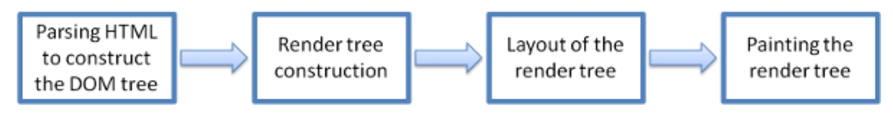

# 浏览器

浏览器是前端开发者每天都要打交道的工具，因此对它的一些基本原理的了解是非常有必要的。本文首先简要介绍浏览器的基本知识，包括浏览器的组成、主流浏览器的内核、渲染引擎的工作流程，然后再结合一个例子来利用 chrome-devtool 来分析网页的性能。

浏览器的主要组成部分如下：

* 用户界面 - 包括地址栏、前进/后退按钮、书签菜单等。除了浏览器的网页显示窗口外，其他都属于用户界面
* 浏览器引擎 - 主要负责用户界面和渲染引擎之间的指令传送
* **渲染引擎** - 负责显示请求的内容，如果请求内容是 HTML，它就负责解析 HTML 和 CSS 内容，并将解析后的内容显示在屏幕上
* 网络 - 负责网络调用，比如 HTTP 请求等
* 用户界面后端 - 用于绘制基本的窗口小部件，比如组合框和窗口
* **JavaScript** 解释器 - 解释执行 JavaScript 代码
* 数据存储 - 持久层，用于浏览器在硬盘上保存各种数据，比如 Cookie 等


## 渲染引擎

从上面我们知道了浏览器是通过渲染引擎来向用户呈现各种内容的，所以它也是浏览器的核心之一，也就是我们常说的浏览器的内核。
（备注：其实对于早起浏览器来说，内核包括渲染引擎和 JS 引擎，但随着后面 JS 引擎越来越独立了以后，内核就倾向于指渲染引擎了，所以下面中提到的内核统一指渲染引擎）

不同的浏览器使用的渲染引擎也不同。这里以当前 5 中主流的浏览器为例进行说明：

**1、IE**:

从 1996 年开始，微软从 Spyglass 手里拿到了 Spyglass Mosaic 的源代码和授权，从那时候开始 IE 的渲染引擎就是 Trident，也就是 IE 的内核。

除了 IE 以外，微软还发布了新的浏览器 Edge，并且在前不久微软也官方宣布使用 chromium 的内核。

**2、Opera**:

于 1995 年挪威 Opera Software ASA 公司发布，2016 年 2 月被骑虎 360 收购，一开始是坚持自研内核，但后来放弃，并且转向了 Webkit 内核，后来和 Google 合作，共同研发了 Blink 内核，所以它现在使用的是 Blink 内核。

**3、Safari**:

由苹果公司 2003 年推出，它的渲染引擎就是 Webkit。虽然 Webkit 内核因 Google 的 Chrome 浏览器出名，但其实 Webkit 是苹果公司开发的。WebKit 前身是 KDE 小组的 KHTML 引擎，可以说 WebKit 是 KHTML 的一个开源的分支。当年苹果在比较了 Gecko 和 KHTML 后，选择了后者来做引擎开发，是因为 KHTML 拥有清晰的源码结构和极快的渲染速度

**4、Firefox**:

Firefox 是由浏览器鼻祖网景公司开发的，于 2004 年正式推出，使用 Gecko 引擎作为内核

**5、Chrome**:

2008 年 Google 发布了它的首款浏览器 Chrome，Chrome 浏览器内核叫 chromium，它是 fork 自开源的 Webkit 引擎，所以严格来说它确实是 Webkit 的一个开源分支，但 Google 将它进行了优化修改。(比如将原先的编译速度从一天提高到了两个小时)同时 Google 还自研了 JavaScript 引擎，也就是大名顶顶的 V8 引擎，极大的提高了 JS 的运行速度。

在 2013 年的时候，Google 宣布正式与苹果的开源浏览器内核 Webkit 分道扬镳，同时和 Opera Software 公司共同合作开发新的内核，也就是现在的 Blink 内核。

以上就是 5 大主流浏览器的内核介绍。这里简单做个总结：

* IE 浏览器内核：Trident 内核，也是俗称的 IE 内核
* Chrome 浏览器内核：统称为 Chromium 内核或 Chrome 内核，以前是 Webkit 内核，现在是 Blink 内核
* Firefox 浏览器内核：Gecko 内核，俗称 Firefox 内核
* Safari 浏览器内核：Webkit 内核
* Opera 浏览器内核：最初是自己的 Presto 内核，后来加入谷歌大军，从 Webkit 又到了 Blink 内核
* 360 浏览器、猎豹浏览器内核：IE + Chrome 双内核
* 搜狗、遨游、QQ浏览器内核：Trident（兼容模式）+ Webkit（高速模式）
* 百度浏览器、世界之窗内核：IE 内核
* 2345 浏览器内核：好像以前是 IE 内核，现在也是 IE + Chrome 双内核了
* UC 浏览器内核：这个众口不一，UC 说是他们自己研发的 U3 内核，但好像还是基于 Webkit 和 Trident，还有说是基于火狐内核。

### 渲染引擎工作流程

在了解了上述浏览器内核的背景下，现在我们来讨论一下渲染引擎的工作流程，这里主要以 Webkit 内核为主。

基本的工作流程如下：



首先，渲染引擎会解析 HTML 文档，转成 DOM 树，同时，也会解析外部 CSS 的文件，解析可视化信息，并和之前的 DOM 树合并，将其变成渲染树(带有视觉属性，如颜色和尺寸)。

在上述的渲染树构建完成后，接下来就进入了 “布局” 阶段，也就是为每一个节点分配一个应该出现在屏幕上的确切坐标。

接下来就是 “绘制阶段”，渲染引擎会遍历渲染树，由 “用户界面后端层” 将每个节点绘制出来。

当然，需要注意的是，以上过程是一个渐进的过程。这是为了能达到更好的用户体验，因此渲染引擎会尽快的将内容显示在屏幕上，而不必等到整个 HTML 文档解析完成后再显示。下面是一个 Webkit 详细的流程图。


这里再给出 Gecko 的工作流程图。如下：


从上面两个流程图对比可知，他们的整体工作流程基本是相同的：都是解析 HTML 和 CSS，然后合并成 “渲染树”，并且经过 “布局” 和 “绘制” 后显示内容。

当然了，两者的一些术语可能稍有不同，比如对于 Webkit 来说，DOM 树和 样式规则的合并称之为 Attachment。而对于渲染树中元素的放置，在 Webkit 中称之为 Layout(布局), 而在 Gecko 中，则称为 Reflow(重排)

### 性能优化之重绘、回流

再了解了上述的基本工作流的基础上，下面也就是我们本章的重点：性能优化之重绘、回流。

**重绘(repaints)**: 当render tree中的一些元素需要更新属性，而这些属性只是影响元素的外观、风格，而不影响布局(例如：background-color)，则称为重绘(repaints)

导致重绘的例子如：outline, visibility, background-color

```js
let box = document.getElementById("box").style
box.color = "red"    // 重绘
box.backgroud-color = "blue"    // 重绘
document.getElementById("box").appendChild(document.createTextNode('abc!'))
```

**回流(reflow)**: 当render tree中的一部分(或全部)，因为元素的规模尺寸、布局、隐藏等改变而需要重新构建，这就是回流(reflow)

* 每个页面至少回流一次，即页面首次加载
* 回流时，浏览器会使渲染树中受到影响的部分失效，并重新构造这部分渲染树
* 回流完成后，浏览器会重新绘制受影响的部分，是重绘过程

导致回流的情况如下：

1. 添加或者删除可见的DOM元素；
2. 元素位置改变；
3. 元素尺寸改变——边距、填充、边框、宽度和高度
4. 内容改变——比如文本改变或者图片大小改变而引起的计算值宽度和高度改变；
5. 页面渲染初始化；
6. 浏览器窗口尺寸改变——resize事件发生时；

```js
let box = document.getElementById("box").style;
box.padding = "2px";   // 回流+重绘
box.border = "1px solid red";  // 再一次 回流+重绘
box.fontSize = "14px";    // 回流+重绘
document.getElementById("box").appendChild(document.createTextNode('abc!'));
```

从上述的两个概念中我们知道：**回流必将引起重绘，重绘不一定引起回流，回流比重绘的代价更高**

当然了，因为回流导致的浏览器开销非常大，因此浏览器针对这些操作进行了一些优化：

对于**多次的回流、重绘变成一次回流重绘**。具体做法是: 浏览器会维护1个队列，把所有会引起回流、重绘的操作放入这个队列，等队列中的操作到了一定的数量或者到了一定的时间间隔，浏览器就会 flush 队列，进行一个批处理。

如下所示：

```js
// 连续的操作下，会入队, 因此一下三个操作只会触发一次回流
box.padding = "2px";   // 回流操作入队
box.border = "1px solid red";  // 回流操作入队
box.fontSize = "14px";    // 回流操作入队, 后续没有其他操作了，则 flush 队列，进行真正的回流操作
```

但有些时候上面的优化会失效，原因如下：

有些情况，当请求向浏览器请求一些style信息的时候，就会让浏览器强制 flush 队列，比如：

* offsetTop, offsetLeft, offsetWidth, offsetHeight
* scrollTop/Left/Width/Height
* clientTop/Left/Width/Height
* width,height
* 请求了 getComputedStyle(), 或者 IE的 currentStyle

当你请求上面的一些属性的时候，浏览器为了给你最精确的值，需要 flush 队列，因为队列中可能会有影响到这些值的操作。即使你获取元素的布局和样式信息跟最近发生或改变的布局信息无关，浏览器都会强行刷新渲染队列。

```js
// 以下会触发 3 次回流
box.padding = "2px";   // 回流操作入队
let x = box.offsetTop; // 读取 offsetTop 属性，强行 flush 队列中的回流操作
box.border = "1px solid red";  // 回流操作入队
let x = box.offsetTop; // 读取 offsetTop 属性，强行 flush 队列中的回流操作
box.fontSize = "14px";    // 回流操作入队
let x = box.offsetTop; // 读取 offsetTop 属性，强行 flush 队列中的回流操作
```

**减少、避免回流和重绘**：

* 减少对render tree的操作【合并多次多DOM和样式的修改】
* 减少对一些style信息的请求，尽量利用好浏览器的优化策略

```js
(1）添加css样式，而不是利用js控制样式
(2）让要操作的元素进行“离线处理”，处理完后一起更新
    当用DocumentFragment进行缓存操作，引发一次回流和重绘
    使用display:none技术，只引发两次回流和重绘
    使用cloneNode(true or false)和replaceChild技术，引发一次回流和重绘
(3）直接改变className，如果动态改变样式，则使用cssText（考虑没有优化的浏览器）
    // bad
    elem.style.left = x + "px";
    elem.style.top = y + "px";
    // good
    elem.style.cssText += ";left: " + x + "px;top: " + y + "px;";
(4）不要经常访问会引起浏览器flush队列的属性，如果你确实要访问，利用缓存
    // bad
    for (var i = 0; i < len; i++) {
      el.style.left = el.offsetLeft + x + "px";
      el.style.top = el.offsetTop + y + "px";
    }
    // good
    var x = el.offsetLeft,
        y = el.offsetTop;
    for (var i = 0; i < len; i++) {
      x += 10;
      y += 10;
      el.style = x + "px";
      el.style = y + "px";
    }
(5）让元素脱离动画流，减少回流的Render Tree的规模
    $("#block1").animate({left:50});
    $("#block2").animate({marginLeft:50});
(6）将需要多次重排的元素，position属性设为absolute或fixed，这样此元素就脱离了文档流，它的变化不会影响到其他元素。例如有动画效果的元素就最好设置为绝对定位；
(7）避免使用table布局：尽量不要使用表格布局，如果没有定宽表格一列的宽度由最宽的一列决定，那么很可能在最后一行的宽度超出之前的列宽，引起整体回流造成table可能需要多次计算才能确定好其在渲染树中节点的属性，通常要花3倍于同等元素的时间。
(8）尽量将需要改变DOM的操作一次完成
    let box = document.getElementById("box").style;
    // bad
    box.color = "red";    // 重绘
    box.size = "14px";    // 回流、重绘
    // good
    box.bord = '1px solid red'
(9）尽可能在DOM树的最末端改变class，尽可能在DOM树的里面改变class（可以限制回流的范围）
(10）IE中避免使用JavaScript表达式
```

## 一个性能优化的简单例子

下面我们就以一个实际例子来说明回流重绘对页面的影响。

首先用无痕浏览模式（避免插件带来的影响）打开下面的网址：

[https://googlechrome.github.io/devtools-samples/jank/](https://googlechrome.github.io/devtools-samples/jank/)

打开后我们就可以看到如下页面，这个是 Google 用来讲解 devtools 性能使用的一个例子。我们打开 devtools 面板，选择 Performance，然后将 CPU 调成 6xslowdown，并且勾选 Screenshoot，同时点击 "Add 10" 按钮，是页面元素变多，同时以比较卡顿为主，如下：


这时候我们可以看到页面已经非常的卡顿了。我们需要有一个指标来实际量化这种卡顿。这个指标就是 FPS，又叫帧率，即每秒渲染的帧数。这个在游戏中比较常见，一般要超过60 FPS 的时候，画面才比较流畅。换算下来，一帧时间大概在 16ms 左右。

chrome 提供了一个测试页面帧率的工具，我们按快捷键 cmd + shift + p (mac 系统)，或者 ctrl + shift + p (win / linux 系统)，调出面板，然后选择 FPS，如下：


我们可以看到当前页面的帧率在 16 fps 左右，远没有达到 60 fps，所以页面才会这么卡顿。

接下来我们就要分析卡顿的原因了。点击 Record 按钮（cmd + E），录制几秒后，stop，然后就得到了如下的性能分析界面：


我们从上到下一次看，最上面是 FPS 的指标，我们看到给出了一条红线，这是表明只有超过了这个红线，页面才不卡，而我们现在的 FPS 还远未达到这个指标。

下面是 CPU 的指标，它和底下的 Summary 对应，我们看到紫色的 Rendering 占据了大部分时间。

现在我们截取一小段详细分析，如下：


我们可以看到平均每帧运行时间大概要 153.9 ms，这个时间和 16ms 相差甚远。我们继续往下看 Main 主程序，这个中横坐标就是运行的时间，纵坐标就是函数的调用栈。我们看到每个 Task 中，Animation Frame Fired 这个函数占据了绝大多数时间，同时 chrome 还在它的右上角标了红色的三角形，其实也表明了这块的性能有问题。

我们往下看，这个函数调用了 app.update，正是这个函数耗时最长，我们点击这个函数，在 Summary 中，chrome 给出了这个函数的代码地址（app.update @ app.js:62），我们点击进入，如下：


关于代码的说明见图中的注释。

我们可以点击页面左侧的 Optimize 按钮，看下是否流畅了很多，当然你也可以在优化的状态下，重新分析下这个页面。

**总结**: 上述例子中我们主要介绍了以下几点：

* 衡量页面是否卡顿的指标：FPS
* 如何利用 Record 进行页面性能分析, 页面分析面板中的各个指标以及含义
* 回流和重绘对性能的影响

## 参考资料

[浏览器的工作原理：新式网络浏览器幕后揭秘](https://www.html5rocks.com/zh/tutorials/internals/howbrowserswork/)

[五大主流浏览器内核](https://zhuanlan.zhihu.com/p/61652177)

[细谈页面回流与重绘](https://juejin.im/post/5c87bd375188257e3e47fdc5)

[chrome-devtools 官网教程](https://developers.google.com/web/tools/chrome-devtools/evaluate-performance/)
