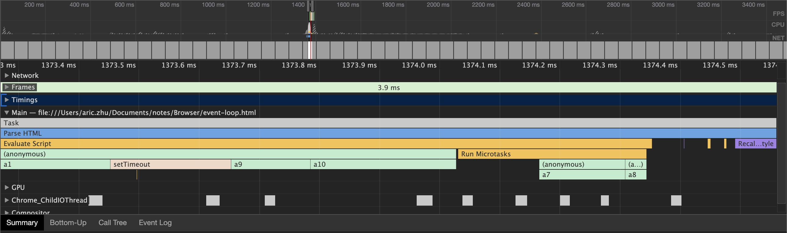
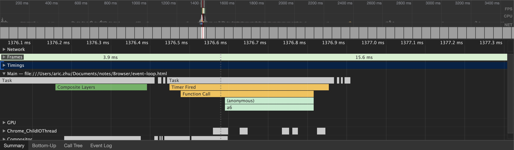
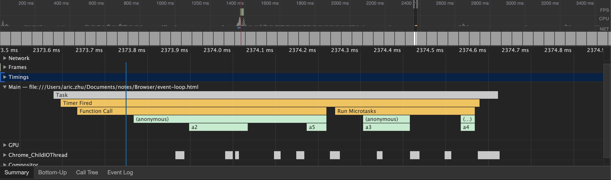
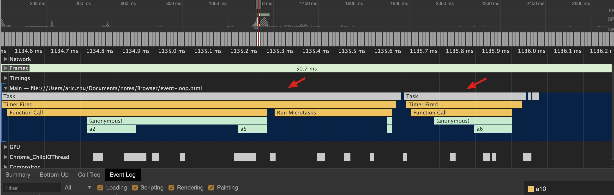

# Event Loop

本文主要讲解浏览器中的事件循环机制 (Event Loop)。

## 事件循环简介

JavaScript 语言的一大特点就是单线程，这也就意味着所有的任务都需要排队，只有当前一个任务结束的时候，才会执行下一个任务。

在 JS 中，所有的任务可以分为两类：同步任务和异步任务。同步任务是指在主线程上排队执行的任务，只有前一个任务执行完毕，才能执行下一个任务；异步任务指的是不进入主线程，而进入“任务队列”（task queue）的任务，只有“任务队列”通知主线程，某个异步任务可以执行了，该任务才会进入主线程执行。

运行机制如下：

```text
(1) 所有同步任务都在主线程上执行，形成一个执行栈(execution context stack)
(2) 主线程之外，还存在一个“任务队列”(task queue), 只要异步任务有了结果，就在“任务队列”之中放置一个事件
(3) 一旦“执行栈”中的所有同步任务执行完毕，系统就会读取“任务队列”，看看里面有哪些事件。那些对应的异步任务于是结束等待状态，进入执行栈，开始执行
(4) 主线程不断重复步骤 (3)
```

上述流程示意图如下：


所以浏览器的主线程就是一个事件循环，也就是 event loop，可以看到在上面的机制下，浏览器才能有效的协调事件、用户交互、脚本、UI 渲染、网络请求、用户代理等任务。

## 任务队列 (task queue)

上面提到了，在主线程中对于那些异步任务，会将他们加入任务队列。那么任务队列又是什么呢？

**任务队列**: 一个事件循环会有一个或者多个任务队列，每个任务队列都是一系列任务按照顺序组成的列表。

这里之所以需要多个任务队列，是因为每个任务都有一个指定的任务源，对于**相同任务源的任务**，按照先后顺序存放在**同一个任务队列中**，而对于**不同任务源的任务**，则需要按照**优先级**存放在**不同的任务队列中**, 比如 ajax 操作的异步非阻塞任务就会被加到 ajax 源的队列中, DOM 事件产生的任务就会被添加到 DOM 事件的任务队列中去

那么 task 任务源又有哪些呢？(macrotask 的产生源)

* **DOM 操作任务源**: 此任务源用于对 DOM 操作作出反应，例如一个元素以非阻塞的方式插入文档
* **用户交互任务源**: 此任务源用于对用户交互作出反应，比如键盘或者鼠标的输入，相应用户操作事件，如 click 等
* **网络任务源**: 此任务用于响应网络活动
* **历史遍历任务源**: 此任务源用于对 history.back() 和类似的 API 的调用排队
* **其他**: 此外，其他的如 setTimeout, setInterval, IndexDB 数据库操作等也都是任务源

## microtask

除了上述说到的在事件循环中有一个或者多个“任务队列”(task queue)外，还存在着一个 microtask 列表，microtask 中的任务通常指：

* Promise.then
* MutationObserver
* Object.observe

所以完整的事件循环机制是这样运行的(以下做了简化，完整流程请查阅[规范](https://html.spec.whatwg.org/multipage/webappapis.html#event-loop-processing-model))

1. 从任务队列中取出最早的一个任务执行, 执行时产生堆栈(JS Stack)
2. 执行 microtask 检查点, 如果 microtask checkpoint的flag（标识）为false，则设为true。执行 队列中的所有 microtask，直到队列为空，然后将microtask checkpoint的flag设为flase(**简单来说就是执行并清空 microtask 队列**)
3. 执行 UI render 操作（可选）, 非每次循环必须，只要满足浏览器60HZ的频率即可
4. 重复1, 此为一个 event loop

由上面的步骤我们可以知道, 在一个循环当中, 每执行一个任务, event loop 都会尝试去清空 microtask 队列. 同时我们可以看到, 在做完上面的操作之后, 才会进行渲染操作, 防止过多的操作重复渲染造成性能问题.

## microtask vs macrotask

**macrotask**的任务有：setTimeout, setInterval, setImmediate, I/O, rendering, DOM 操作, 用户交互事件, 网络等

**microtask**的任务有：promise.then, process.nextTick, Object.observe, MutationObserver

这两者的区别在于每一次的 event loop 只会取一个 macrotask 来运行，但是会清空 microtask 队列中的所有任务。所以，如果 microtask 队列过长，确实会阻塞 macrotask 的运行。js 是使用同步的方式来执行 microtask 的。

另外，从字面意思上，macrotask 属于 task，也就是大型任务，microtask 属于 job，也就是小型任务。

## 例子

首先我们看下如下网站上的几个例子，对任务队列(task queue)，microstask queue，JS Stack 等有一个直观的感受。(**一定要将这几个例子从头到尾的看一遍**)

[Tasks, microtasks, queues and schedules](https://jakearchibald.com/2015/tasks-microtasks-queues-and-schedules/)

我们再以一个实际的例子来说明上述过程，如下：

```js
var init = new Date().getTime()
function a1(){ console.log('1') }
function a2(){ console.log('2') }
function a3(){ console.log('3') }
function a4(){ console.log('4') }
function a5(){ console.log('5') }
function a6(){ console.log('6') }
function a7(){ console.log('7') }
function a8(){ console.log('8') }
function a9(){ console.log('9') }
function a10(){
  for(let i = 1;i<10000;i++){}
  console.log('10')
}

a1()
setTimeout(() => {
    a2()
    console.log(new Date().getTime()-init)
    Promise.resolve()
        .then(() => { a3() })
        .then(() => { a4() })
    a5()
}, 1000)

setTimeout(()=>{
    a6()
    console.log(new Date().getTime()-init)
}, 0)

Promise.resolve()
    .then(() => { a7()})
    .then(() => { a8() })

a9()
a10()
```

上述代码运行过程分析如下：

**第一次循环**:

1. a1()
2. setTimeout1丢到定时线程中去计时
3. setTimeout2丢到定时线程中去计时
4. Promise.then() 的cb a7()放入microtask队列
5. a9()
6. a10()
7. 检查执行microtask
8. a7() ，将cb a8放入microtask
9. a8()

(计时线程到时间后，将计时器的回调函数按顺序放入任务队列中)

**第二次循环**：

从任务队列中读到setTimeout2 cb

1. a6()
2. 输出时间console.log(new Date().getTime()-init)

因为setTimeout总是计时结束之后，在任务队列中排队等待执行，所以它执行的时间，总是大于等于开发者设置的时间

但是，即便设置为0，且当前没有正在执行的任务的情况下，时间也不可能为0，因为规范规定，最小时间为4ms！

**第三次循环**：

从任务队列中读到setTimeout1 cb

1. a2()
2. 输出时间console.log(new Date().getTime()-init)
3. 将 Promise.then() 的cb a3放入microtasks
4. a5()
5. 检查执行microtask
6. a3() 将cb a4放入microtasks
7. a4()

**验证**:

我们用无恒模式打开 chrome devtools 的 Performance 面板，来验证上述的结果：

首先我们写一个 event-loop.html ，将上述代码放入 script 标签中，然后用 chrome 打开。接着我们进行 Record 开始录制，并刷新页面，得到的结果如下：







从上述图中，我们可以清楚的看到三次的 event loop 中运行的 task 以及 microtask。

这里还需要注意的一点是，在本例中，两个 setTimeout 是间隔了 1000 ms执行的，所以肯定是分散在了两个 task，也就是 event loop 中运行，但其实，如果两个 setTimeout 都是间隔时间为 0 的话(比如：setTimeout(fn1, 0), setTimeout(fn2, 0))，他们同样也会分散在两个 event loop 中运行，这是因为之前说过的每一个 event loop 只运行一个 macrotask。可以修改上述的示例来验证一下（将原先的 setTimeout(() => {a2(); //...; a5()}, 1000)修改为 setTimeout(() => {a2(); //...; a5()}, 0))



如上图所示，此时虽然两个 setTimeout 都是为 0，但他们还是分两次 task (event loop)运行。

## nodejs 中的 process.nextTick 与 setImmediate

在 nodejs 中，还提供了 process.nextTick 和 setImmediate 这两个方法。

**process.nextTick**: 在当前执行栈的尾部，下一次 event loop 触发前调用回调函数。这里需要注意，对于多个 process.nextTick，同样也会在本次的执行栈中全部执行完成

**setImmediate**: 在下一轮 event loop 中添加事件，类似于 setTimeout(fn, 0)

## 参考资料

[JavaScript 运行机制详解：再谈Event Loop](http://www.ruanyifeng.com/blog/2014/10/event-loop.html)

[chrome 浏览器页面渲染工作原理解析](https://zhuanlan.zhihu.com/p/30134423)

[Event Loop 中的 microtask 与 macrotask](https://juejin.im/entry/5a7864d4f265da4e914b3dc7)

[Tasks, microtasks, queues and schedules](https://jakearchibald.com/2015/tasks-microtasks-queues-and-schedules/)

[规范](https://html.spec.whatwg.org/multipage/webappapis.html)
