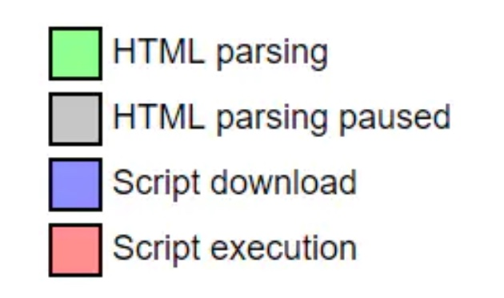
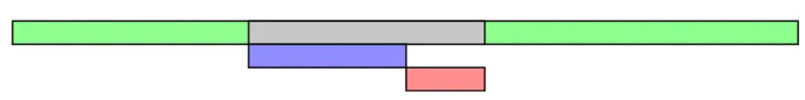
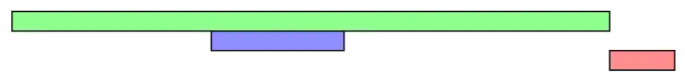
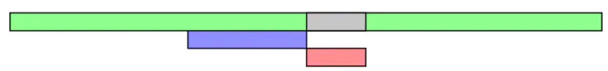
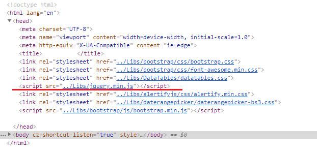
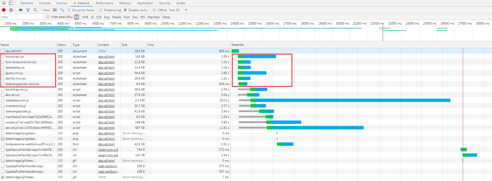
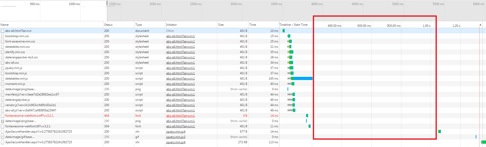
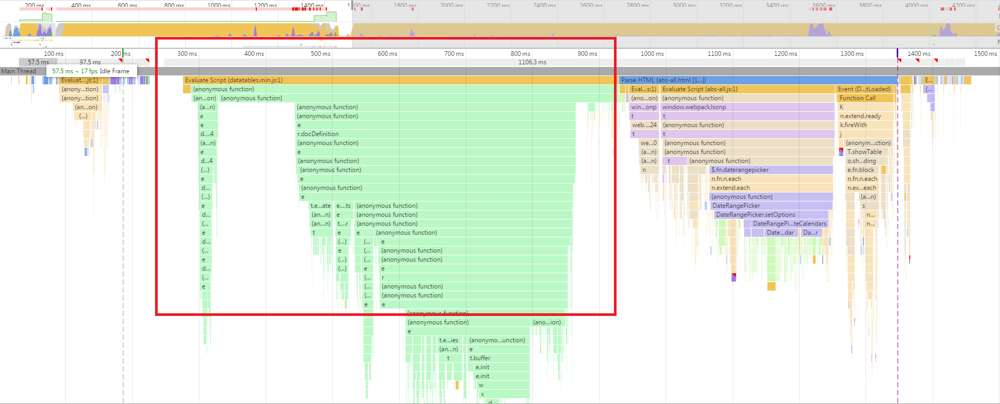

# HTML 的解析过程

我们知道在浏览器是将 html，css，js 等文件进行解析后才显示在网页上的，它的完整流程如下：


当然，本文并不将全部的解析流程，而是重点介绍浏览器对于 HTML 文档的解析

## DOM 解析过程

整个dom的解析过程是顺序，并且渐进式的。

顺序指的是从第一行开始，一行一行依次解析；渐进式则指得是浏览器会迫不及待的将解析完成的部分显示出来，如果我们做下面这个实验会发现，在断点处第一个div已经在浏览器渲染出来了：

```html
<!DOCTYPE html>
<html>
<head>
</head>
<body>
    <div>
        first div
    </div>
    <script>
        debugger
    </script>
    <div>
        second div
    </div>
</body>
</html>
```

既然dom是从第一行按顺序解析，那么我们怎么判断dom何时解析完成呢？这里就有两个函数 window.onload 和 DOMContentLoaded

**DOMContentLoaded**: 当 DOMContentLoaded 事件触发时，仅当DOM加载完成，不包括样式表，图片，flash 等其他资源

**onload**: 当 onload x事件触发时，页面上所有的DOM，样式表，脚本，图片，flash都已经加载完成了

html 从第一行开始解析，遇到外联资源(外联 css、外联 javascript、image、iframe 等)就会请求对应资源，那么请求过程是否会阻塞 dom 的解析过程呢？答案是看情况，有的资源会，有的资源不会。下面按是否会阻塞页面解析分为两类：阻塞型与非阻塞型，注意这里区分两类资源的标志是 document 对象派发 DOMContentLoaded 事件的时间点，认为派发DOMContentLoaded 事件才表示 dom 树构建完成

### 阻塞型

会阻塞 dom 解析的资源主要包括：

* 内联css
* 内联 javascript
* 外联普通 javascript
* 外联 defer javascript
* javascript 标签之前的外联 css

外联 javascript 可以用 async 与 defer 标示，因此这里分为了三类：外联普通 javascript，外联 defer javascript、外联 async javascript，这几类外联javascript 本篇后面有详细介绍

dom 解析过程中遇到外联普通 javascript 会暂停解析，请求拿到 javascript 并执行，然后继续解析 dom 树

对于外联 defer javascript 这里重点说明下为什么也归于阻塞型。前面也说了，这里以 document 对象派发 DOMContentLoaded 事件来标识 dom 树构建完成，而 defer javascript 是在该事件派发之前请求并执行的，因此也归类于阻塞型，但是需要知道，defer的 javascript 实际上是在 dom 树构建完成与派发 DOMContentLoaded 事件之间请求并执行的

另外需要注意的是javascript标签之前的外联css。其实按说css资源是不应该阻塞dom树的构建过程的，毕竟css只影响dom样式，不影响dom结构，MDN上也是这么解释的:

```text
The DOMContentLoaded event is fired when the initial HTML document has been completely loaded and parsed, without waiting for stylesheets, images, and subframes to finish loading.
```

但是实际情况是dom树的构建受javascript的阻塞，而javascript执行时又可能会使用类似Window.getComputedStyle()之类的API来获取dom样式，比如:

```javascript
const para = document.querySelector('p');
const compStyles = window.getComputedStyle(para);
```

因此浏览器一般会在遇到 script 标签时将该标签之前的外联 css 请求并执行完成。但是注意这里加了一个前提条件就是 javascript 标签之前的外联 css，就是表示被 javascript 执行依赖的外联 css

这些阻塞型的资源请求并执行完之后dom树的解析便完成了，这时document对象就会派发DOMContentLoaded事件，表示dom树构建完成

### 非阻塞型

不阻塞dom解析的资源主要包括：

* javascript标签之后的外联css
* image
* iframe
* 外联 async javascript

dom 树解析完成之后会派发 DOMContentLoaded 事件，对于外联 css 资源来说分为两类，一类是位于 script 标签之前，一类是位于 script 标签之后。位于 script 标签之后的外联 css 是不阻塞 dom 树的解析的

DOMContentLoaded 事件用来标识 dom 树构建完成，那如何判断另外这些非阻塞型的资源加载完成呢？答案是 window.onload。由于该事件派发的过晚，因此一般情况下我们用不着，而更多的是用 DOMContentLoaded 来尽早的的操作 dom

另外还有image、iframe以及外联async javascript也不会阻塞dom树的构建

## 外联 javascript 加载过程

html 中可以内联 javascript，也可以引入外联 javaScript。而外联 javascript 又分为以下几种：

* 外联普通 javascript

```html
<script src="index.js"></script>
```

* 外联 defer javascript

```html
<script defer src="index.js"></script>
```

* 外联 async javascript

```html
<script async src="index.js"></script>
```

其中第一种就是外联普通 javascript，会阻塞 html 的解析，html 解析过程中每遇到这种 script 标签就会请求并执行，如下图所示，绿色表示 html 解析；灰色表示 html 解析暂停；蓝色表示外联 javascript 加载；粉色表示 javascript 执行



下面是外联普通的 javascript 的加载过程：



第二种外联 defer javascript 稍有不同，html 解析过程中遇到此类 script 标签不阻塞解析，而是会暂存到一个队列中，等整个 html 解析完成后再按队列的顺序请求并执行javascript，但是这种外联 defer javascript 全部加载并执行完成后才会派发DOMContentLoaded 事件，外联 defer javascript 的加载执行过程如下：



第三种外联 async javascript 则不阻塞 html 的解析过程，注意这里是说的脚本的下载过程不阻塞 html 解析，如果下载完成后 html 还没解析完成，则会暂停 html 解析，先执行完成下载后的 javascript 代码再继续解析 html，过程如下:



但是如果 html 已经解析完毕，外联 async javascript 还未下载完成，则不阻塞 DOMContentLoaded 事件的派发。因此外联 async javascript 很有可能来不及监听 DOMContentLoaded 事件

## 在 chrome 中的外联 css，js 的并发加载

外部脚本会进行并发加载，但需要注意 chrome 的并发连接数（同一域名）上限为 6 个






由上面两张截图可以看到，jquery.min.js 脚本文件与 bootstrap.css 等样式文件并行加载，但是由于 chrome 的并发连接数上限为 6 个，因此 bootstrap.min.js 脚本、xxx.css 样式等文件的加载会等待前面的文件加载完成，有可用连接数的时候才开始加载

了解以上信息之后，我们可以对该页面进行相应优化，例如对CSS文件进行压缩处理、使用 CDN，将资源分布在多个域名下、合并 CSS 文件，减少 HTTP 请求数量等，来提高 CSS 的加载速度，减少 HTML 文档解析和渲染的阻塞时间

浏览器的并发请求数目限制是针对同一域名的。因此可以使用 CDN 加速技术来提高用户访问网站的响应速度，这样使用了 CDN 的资源加载不会占用当前域名下的并发连接数，从而减少阻塞的时间

### js 阻塞导致的性能问题分析



上图是一个项目页面的 Network 截图，红色框中的部分出现了约 700ms 左右的空白，我们需要知道为什么页面的加载会出现这样的情况，这段空白时间浏览器在干什么？

我们分析 Timeline 图，看看浏览器在这段时间的具体信息，如下：



通过 Timeline 图我们可以看到，在 250ms~900ms 时间区间内，浏览器在执行 datatables.min.js 脚本代码，这个脚本的执行阻塞了文档的解析，耗时约 700ms，对应了 Network 图中的空白。

我们继续查看页面总的耗时时间，评估 700ms 耗时的影响，如下：


可以看到，页面总的完成耗时为 1.66s，由此可知 datatables.min.js 的执行耗时占了很大比重，应当慎重考虑是否一定要使用这个插件，能否使用其他轻量级的插件进行替代，或者能否精简插件的不必要模块，或者舍弃插件的使用

## 参考资料

[浏览器是如何解析html的？](https://juejin.im/post/5c1dde33f265da61776bf49a)

[window.onload 和 DOMContentLoaded 的区别](https://www.jianshu.com/p/1a8a7e698447)

[浏览器解析渲染HTML文档的过程](https://segmentfault.com/a/1190000018652029)
