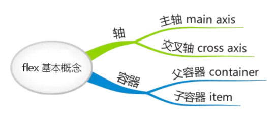
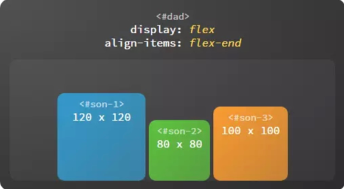
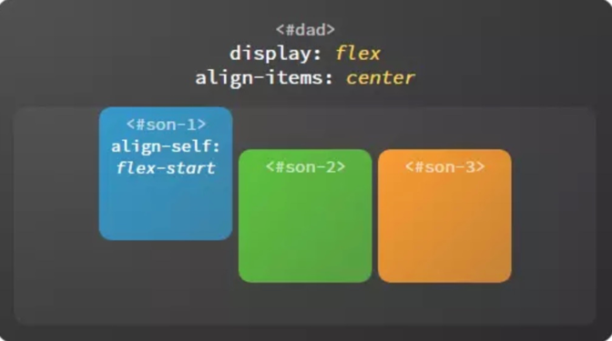
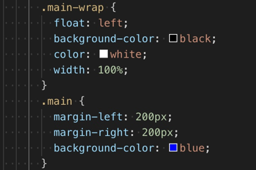
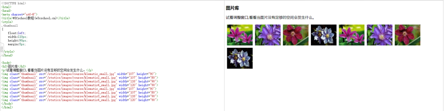

# CSS 布局

## flex 弹性布局

css 规定的标准布局有 3 种：标准文档流、浮动布局和固定布局。虽然这三种布局可以应付绝大部分情况，但对于垂直和水平同时居中的情况还是无法优雅的实现。所以第四种布局 flex 布局就应运而生了，flex 布局又叫弹性布局

flex布局共12个属性，父容器、子容器各6个，总结如下:

flex布局有两个关键概念：容器和轴。对于flex布局首先一定要有父容器，并且它的display设为flex。然后父容器中包含有子元素。而轴又分为主轴和交叉轴。如下：

### 容器

#### 父容器

容器具有这样的特点：父容器可以统一设置子容器的排列方式，子容器也可以单独设置自身的排列方式，如果两者同时设置，以子容器的设置为准

* 设置子容器沿主轴的排列方式：justify-content

**flex-start**：设置起始端对齐，效果如下：

**flex-end**：设置末尾端对齐，效果如下：

**center**：设置居中对齐，效果如下：

**space-around**：子容器沿主轴均匀分布，位于首尾两端的子容器到父容器的距离是子容器间距的一半，效果如下：

**space-between**：子容器沿主轴均匀分布，位于首尾两端的子容器与父容器相切，效果如下：

* 设置子容器沿交叉轴的排列方式：align-items

**flex-start**：设置起始端对齐，效果如下：

**flex-end**：设置末尾端对齐，效果如下：

**center**：设置居中对齐，效果如下：

**baseline**：基线对齐

这里的 baseline 默认是指首行文字，即 first baseline，所有子容器向基线对齐，交叉轴起点到元素基线距离最大的子容器将会与交叉轴起始端相切以确定基线。如下：

**stretch**：子容器沿交叉轴方向的尺寸拉伸至与父容器一致，效果如下：

* 设置换行方式：flex-wrap

决定子容器是否换行排列，不但可以顺序换行而且支持逆序换行

**nowrap**：不换行，效果如下：

**wrap**：换行，效果如下：

**wrap-reverse**：逆序换行，逆序换行是指沿着交叉轴的反方向换行，效果如下：

* 多行沿交叉轴对齐：align-content

当子容器多行排列时，设置行与行之间的对齐方式

**flex-start**：起始端对齐，效果如下：

**flex-end**：末尾端对齐，效果如下：

**center**：居中对齐，效果如下：

**space-around**：等边距均匀分布，效果如下：

**space-between**：等间距均匀分布，效果如下：

**stretch**：拉伸对齐，效果如下：

#### 子容器

* 在主轴上伸缩：flex

子容器是有弹性的（flex 即弹性），它们会自动填充剩余空间，子容器的伸缩比例由 flex 属性确定

* 单独设置子容器如何沿交叉轴排列：align-self

每个子容器也可以单独定义沿交叉轴排列的方式，此属性的可选值与父容器 align-items 属性完全一致，如果两者同时设置则以子容器的 align-self 属性为准

**flex-start**：起始端对齐，效果如下：

**flex-end**：末尾端对齐，效果如下：

**center**：居中对齐，效果如下：

**baseline**：基线对齐，效果如下：

**stretch**：拉伸对齐，效果如下：

* 设置基准大小：flex-basis

flex-basis 表示在不伸缩的情况下子容器的原始尺寸。主轴为横向时代表宽度，主轴为纵向时代表高度

* 设置扩展比例：flex-grow

子容器弹性伸展的比例。如图，剩余空间按 1:2 的比例分配给子容器

* 设置收缩比例：flex-shrink

子容器弹性收缩的比例。如图，超出的部分按 1:2 的比例从给子容器中减去

* 设置排列顺序：order

改变子容器的排列顺序，覆盖 HTML 代码中的顺序，默认值为 0，可以为负值，数值越小排列越靠前

### 轴

如图所示，轴 包括 主轴 和 交叉轴，我们知道 justify-content 属性决定子容器沿主轴的排列方式，align-items 属性决定子容器沿着交叉轴的排列方式。那么轴本身又是怎样确定的呢？在 flex 布局中，flex-direction 属性决定主轴的方向，交叉轴的方向由主轴确定

#### 主轴

主轴的起始端由 flex-start 表示，末尾段由 flex-end 表示。不同的主轴方向对应的起始端、末尾段的位置也不相同

**向右**：flex-direction: row

**向下**：flex-direction: column

**向左**：flex-direction: row-reverse

**向上**：flex-direction: column-reverse

#### 交叉轴

主轴沿逆时针方向旋转 90° 就得到了交叉轴，交叉轴的起始端和末尾段也由 flex-start 和 flex-end 表示

上面介绍的几项属性是 flex 布局中最常用到的部分，一般来说可以满足大多数需求，如果实现复杂的布局还需要深入了解更多的属性

## 双飞翼布局

双飞翼布局是一种常见的布局方式，该布局方式最先由淘宝开发使用，具有如下特点：

* 三栏式布局，分为左边栏，中间主栏，右边的额外内容栏
* 中间内容栏能随窗体宽度大小自适应
* HTML加载顺序是先加载中间的内容，然后加载左边栏，最后加载右边额外栏，真正的实现了按重要性加载

首先我们要考虑的是中间栏需要先加载，那么中间的div需要放在最前面，然后是需要利用负的margin的特性来保证三个div标签在一行中。如下：

上述内容渲染出来的效果如下：

可以看到已经是三列布局，并且主栏标签在最前面，也就是最先渲染。但存在着一个问题，那就是主列的内容被子列覆盖掉了

要解决以上问题，其实很简单，就是在主列外面再包一层，然后主列的内容的可以设置margin值来使得其中的内容区域与子列和附加列有距离, 如下：

最后的渲染效果如下：

可以看到现在已经实现了双飞翼布局

## float 属性

通过float属性可以将元素生成一个块级框，并向左或者向右进行浮动，直到遇到其他元素的边框为止。当元素设置了float属性以后，display属性失效

对于一个浮动元素来说，它的前面的元素不受影响，但它后面的元素会围绕它排列。如下两张图，图片分别是左浮动和右浮动，它后面的文字围绕这个图片布局

多个浮动元素如果有空间的话可以彼此相邻，如下：

浮动元素的后面的元素会受浮动元素影响重新排列，如果想消除这种影响，则可以设置clear（设置的值如下：clear:left, clear: right, clear: both）属性来指定后面的元素两侧是否可以出现浮动元素（其效果相当于让元素另外占据一行）。如下图所示：

## position 属性

position属性结合left、right、top、bottom用来定位元素位置，主要有static、relative、fixed和absolute这四个值

### static

默认定位，html元素默认的定位方式。采用该方式定位的元素在正常文档流中，占据相应的空间，并且不受left, right, top, bottom的影响

### relative

相对定位，通常用来做absolute定位的容器。表示元素的内容相对其正常位置，通过left, right, top, bottom来控制，并且元素原先正常的位置还占据着

图1是三个元素都采用默认定位方式，图2则是绿色块使用relative方式定位，可以看到绿色块重叠在了另外两个元素上，并且绿色块原先占据的位置还在

### fixed

固定定位，脱离了正常文档流，不占据正常文档流的空间。该定位方式是相对于浏览器的位置，通过left, right, top, bottom来控制位置

如下图所示，顶部的绿色方块就是fixed定位，它相对于浏览器left距离500px, top距离0px，并且不占据原先文档流空间, 下面的粉色方块则是正常的元素，当鼠标往下滚动时，绿色方块始终保持原位置，并不会变化

### absolute

绝对定位，脱离了正常文档流，不占据正常文档流空间。该定位方式是相对于第一个relative定位的父级元素的定位方式，如果父级没有relative定位，那么就相对于<html>元素。通过left, right, top, bottom来控制位置

如下图所示，其中绿色块为absolute定位，其相对父级relative定位的元素left距离为10px，top距离为15px，因为脱离了正常文档流，并不占据空间，所以可以重叠在其他元素上面

## 参考资料

[一劳永逸的搞定 flex 布局](https://juejin.im/post/58e3a5a0a0bb9f0069fc16bb#comment)

[CSS布局之--淘宝双飞翼布局](http://www.cnblogs.com/langzs/archive/2013/01/27/taobaoshuangfeiyi.html)