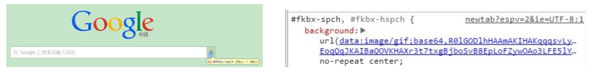

# Base64 编码

Base64 是一组相似的二进制到文本（binary-to-text）的编码规则, 使得二进制数据在解释成 radix-64 的表现形式后能够用 ASCII 字符串的格式表示出来

在 JavaScript 中，两个函数分别被用来处理编码和解码 base64 字符串：

* btoa(): 根据 “字符串” 创建一个 base-64 编码的 ASCII 字符串
* atob(): 将上述通过 btoa 编码的字符串进行解码

## 图片 Base64 编码

在前端中，将图片进行 Base64 编码后直接嵌入文档中，可以减少一次图片的 http 请求，从而优化网页加载速度，应用场景较多。一个简答的图片 base64 编码如下：



从图片中我们可以看到，一个图片的 base64 编码字符串中以 "data:xxxx;base64," 为开头，这里的 "xxxx" 表示图片的格式，后面则是用 base64 编码的具体内容

图片的 base64 字符串在 css 中的引入方式如下：

```css
#fkbx-spch, #fkbx-hspch {
  background: url(data:image/gif;base64,R0lGODlhHAAmAKIHAKqqqsvLy0hISObm5vf394uLiwAAAP///yH5B…EoqQqJKAIBaQOVKHAXr3t7txgBjboSvB8EpLoFZywOAo3LFE5lYs/QW9LT1TRk1V7S2xYJADs=) no-repeat center;
}
```

在 html 中的引入方式如下：

```html

```

虽然使用图片的 base64 编码可以减少一次单独的 http 请求，但 base64 编码出来的内容通常比原图片大小略大，同时如果插入一个过大的 base64 字符串，会导致 html、css 内容过于庞大

因此，对于比较大的图片，通常不建议使用 base64 编码插入 html、css 中

## nodejs 中处理 Base64 图片

将 Base64 字符串保存为图片：

```js
var app = require('express')();
app.post('/upload', function(req, res){
    //接收前台POST过来的base64
    var imgData = req.body.imgData;
    //过滤data:URL
    var base64Data = imgData.replace(/^data:image\/\w+;base64,/, "");
    var dataBuffer = new Buffer(base64Data, 'base64'); // 解码图片
    // var dataBuffer = Buffer.from(base64Data, 'base64'); // 这是另一种写法
    fs.writeFile("image.png", dataBuffer, function(err) {
        if(err){
          res.send(err);
        }else{
          res.send("保存成功！");
        }
    });
});
```

将图片编码为 Base64 字符串：

```js
const fs = require('fs');
let bitmap = fs.readFileSync('start.jpg');

let base64str = Buffer.from(bitmap, 'binary').toString('base64'); // base64编码
console.log(base64str);
```

## 参考资料

[Base64的编码与解码](https://developer.mozilla.org/zh-CN/docs/Web/API/WindowBase64/Base64_encoding_and_decoding)

[【前端攻略】：玩转图片Base64编码](https://www.cnblogs.com/coco1s/p/4375774.html)

[nodejs 图片base64处理](https://juejin.im/post/5c8c61b36fb9a049ba4278c3)
