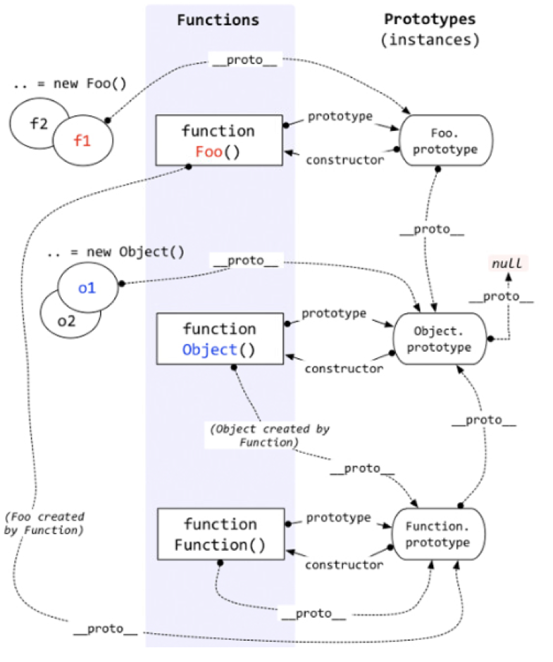

# JS 基础知识

## 原型链

我们通过以下概念来一步步说明在 JS 中原型链的知识：

1. 在 JS 中一切皆对象 (除 number, string, boolean, null, undefined 外), 所以数组，函数，对象等都是对象
2. 所有对象都是由函数实例出来的，也就是 new Fxxx() 这种形式创建的
3. 接上一点，对于数组，对象，函数本质上也是由函数创建的，array 类型的对象由 new Array() 创建，object 类型的对象由 new Object() 创建，function 类型的由 new Function() 创建, 当然我们可以用 let arr = [], let obj = {} 来创建数组和对象，这其实就是一种语法糖，本质上调用的就是 new Array() 以及 new Object()
4. 所有的函数都有一个 prototype 属性，也就是原型属性，这个属性中包含了所有对象的共享方法（此处的所有对象特指被这个函数实例化的对象）, prototype 属性中有个 constructor 属性，指向了该函数本身
5. 所有被实例化的对象都有一个隐式原型属性，它指向了对应的函数的 prototype 属性，而这个隐式原型属性一般被浏览器厂商实现为 \_\_proto\_\_ 属性，所以对于 ```let a = new Object()```，我们可得 a.\_\_proto\_\_ === Object.prototype
6. 由于一个普通函数的 prototype 属性也是一个对象，因此它也是由 new Object() 创建的，所以对于普通的方法，它的原型属性 prototype 的隐式原型指向 Object.prototype，所以对于 ```function Foo () => {}```， 我们可得 Foo.prototype.\_\_proto\_\_ === Object.prototype
7. 根据规定，对于 Object 函数，它的原型属性 prototype 的隐式原型指向 null，即 Object.prototype.\_\_proto\_\_ === null
8. 所有的函数都是由 Function 创建的，包括 Function 本身，因此我们可以得到 Function.\_\_proto\_\_ === Function.prototype
9. 当一个对象获取某个属性的时候，它会先找自身的属性，如果没有，则沿着 \_\_proto\_\_ 一直往上找，直到找到或者返回 undefined。在沿着 \_\_proto\_\_ 往上寻找的过程中，由 \_\_proto\_\_ 组成的链式结构就是 JS 中所说的原型链。

具体可看下图：



**举例：**由上图可知，对于一个 new Foo() 得到的实例对象 f1，首先会从 f1 本身寻找，如果没有，则沿着 \_\_proto\_\_，也就是 Foo.prototype 中查找，如果还没有，在继续沿着 \_\_proto\_\_ 往上找，也就是在 Object.prototype 中寻找，如果还没有的话，则继续沿着 \_\_proto\_\_ 往上找，也就是在 null 中寻找，最终返回 undefined

### 相关补充

* in

in 运算符是判断某个属性是否在对象中，不仅包括对象本身的属性，也包括原型链中的所有属性，只要包含则返回 true

* hasOwnProperty

这个是对象判断该属性是否是本身属性的方法，而不是通过原型继承得来的

* instanceof

instanceof 这个运算符就是根据原型链的方式来运行的，运算符左边的对象沿着 \_\_proto\_\_ 往上查找，运算符右边的对象沿着 prototype 往上查找，如果能找到相同的引用，则返回 true，否则返回 false

* Object.create(obj)

该方法创建一个新的实例对象，同时该实例对象的 \_\_proto\_\_ 指向 obj，通常可以通过 Object.create(null) 来创建一个纯净的对象

一个简单的实现如下:

```js
Object.create =  function (o) {
    var F = function () {}
    F.prototype = o
    return new F()
}
```

## 继承 以及 es6 中的 class 语法

## 闭包

## this 指向

## 参考资料

[深入理解javascript原型和闭包（完结）](https://www.cnblogs.com/wangfupeng1988/p/3977924.html)
