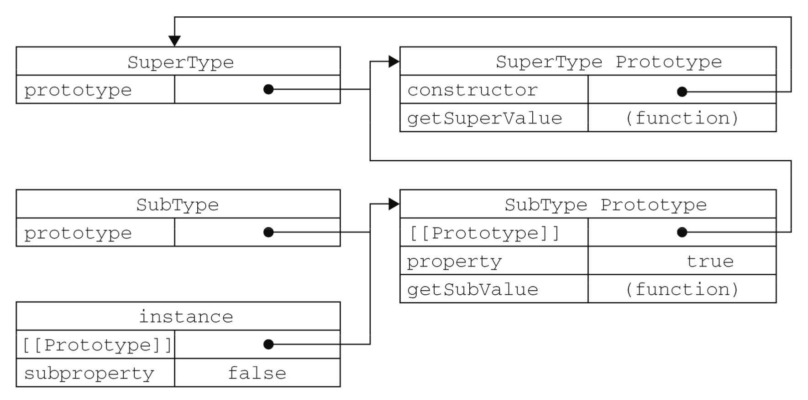
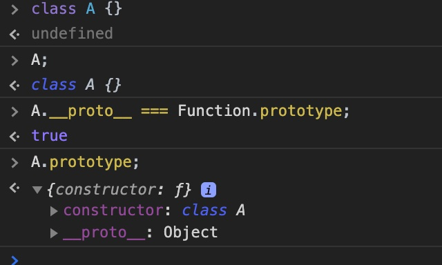
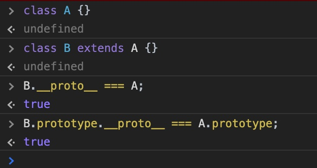

# JS 基础知识

## 原型链

我们通过以下概念来一步步说明在 JS 中原型链的知识：

1. 在 JS 中一切皆对象 (除 number, string, boolean, null, undefined 外), 所以数组，函数，对象等都是对象
2. 所有对象都是由函数实例出来的，也就是 new Fxxx() 这种形式创建的
3. 接上一点，对于数组，对象，函数本质上也是由函数创建的，array 类型的对象由 new Array() 创建，object 类型的对象由 new Object() 创建，function 类型的由 new Function() 创建, 当然我们可以用 let arr = [], let obj = {} 来创建数组和对象，这其实就是一种语法糖，本质上调用的就是 new Array() 以及 new Object()
4. 所有的函数都有一个 prototype 属性，也就是原型属性，这个属性中包含了所有对象的共享方法（此处的所有对象特指被这个函数实例化的对象）, prototype 属性中有个 constructor 属性，指向了该函数本身
5. 所有被实例化的对象都有一个隐式原型属性，它指向了对应的函数的 prototype 属性，而这个隐式原型属性一般被浏览器厂商实现为 \_\_proto\_\_ 属性，所以对于 ```let a = new Object()```，我们可得 a.\_\_proto\_\_ === Object.prototype
6. 由于一个普通函数的 prototype 属性也是一个对象，因此它也是由 new Object() 创建的，所以对于普通的方法，它的原型属性 prototype 的隐式原型指向 Object.prototype，所以对于 ```function Foo () => {}```， 我们可得 Foo.prototype.\_\_proto\_\_ === Object.prototype
7. 根据规定，对于 Object 函数，它的原型属性 prototype 的隐式原型指向 null，即 Object.prototype.\_\_proto\_\_ === null
8. 所有的函数都是由 Function 创建的，包括 Function 本身，因此我们可以得到 Function.\_\_proto\_\_ === Function.prototype
9. 当一个对象获取某个属性的时候，它会先找自身的属性，如果没有，则沿着 \_\_proto\_\_ 一直往上找，直到找到或者返回 undefined。在沿着 \_\_proto\_\_ 往上寻找的过程中，由 \_\_proto\_\_ 组成的链式结构就是 JS 中所说的原型链。

具体可看下图：


**举例：**由上图可知，对于一个 new Foo() 得到的实例对象 f1，首先会从 f1 本身寻找，如果没有，则沿着 \_\_proto\_\_，也就是 Foo.prototype 中查找，如果还没有，在继续沿着 \_\_proto\_\_ 往上找，也就是在 Object.prototype 中寻找，如果还没有的话，则继续沿着 \_\_proto\_\_ 往上找，也就是在 null 中寻找，最终返回 undefined

### 相关补充

* in

in 运算符是判断某个属性是否在对象中，不仅包括对象本身的属性，也包括原型链中的所有属性，只要包含则返回 true

* hasOwnProperty

这个是对象判断该属性是否是本身属性的方法，而不是通过原型继承得来的

* instanceof

instanceof 这个运算符就是根据原型链的方式来运行的，运算符左边的对象沿着 \_\_proto\_\_ 往上查找，运算符右边的对象沿着 prototype 往上查找，如果能找到相同的引用，则返回 true，否则返回 false

* Object.create(obj)

该方法创建一个新的实例对象，同时该实例对象的 \_\_proto\_\_ 指向 obj，通常可以通过 Object.create(null) 来创建一个纯净的对象

一个简单的实现如下:

```js
Object.create =  function (o) {
    var F = function () {}
    F.prototype = o
    return new F()
}
```

## 继承

JS 是一种基于原型的语言，有别于传统的基于面向对象的 Java，python 等语言，这也导致了它的继承的语法和用法有很大的不同。

**1. 原型继承**: 原型继承是指一个子类的原型属性是父类的实例对象，如下：

```js
// 父类
function SuperType () {
  this.property = true
}
SuperType.prototype.getSuperValue = function () {
  return this.property
}
// 子类
function SubType () {
  this.subproperty = false
}
// 原型继承
SubType.prototype = new SuperType()
SubType.prototype.getSubValue = function () {
  return this.subproperty
}

let ins = new SubType()
console.log(ins.getSuperValue()) // true
```

他们之间的关系如下图所示:



优点：

* 能继承父类所有的属性，包括实例属性以及原型属性

缺点：

* 新实例无法向父类构造函数传参
* 新实例共享父类的实例属性, 因此当实例修改了父类实例属性，会影响所有实例

**2. 借用构造函数继承**: 为了解决上述原型继承中的两个问题，开发人员提出了构造函数的继承方式。它是通过在子类构造函数中用 call 或者 apply 来调用父类构造函数, 从而实现继承的方式。如下：

```js
// 父类
function SuperType (name) {
  this.name = name
}
// 子类
function SubType (name, age) {
  // 继承了 SuperTye， 同时还传递了参数 name
  SuperType.call(this, name)
  // 实例属性
  this.age = age
}
```

优点：

* 解决了在继承父类时无法传参的问题
* 解决了共享父类实例属性的问题

缺点：

* 只能继承父类实例属性，无法继承父类的原型属性

**3. 组合继承(常用)**: 组合继承就是结合上述的原型继承和构造函数的继承，通过构造函数继承来继承父类的实例属性，通过原型继承来继承父类的原型属性。如下：

```js
// 父类
function SuperType (name) {
  this.name = name
  this.colors = ['red', 'blue', 'green']
}
SuperType.prototype.sayName = function () {
  console.log(this.name)
}
// 子类
function SubType (name, age) {
  // 构造函数继承，继承父类实例属性
  SuperType.call(this, name) // 第二次调用
  this.age = age
}
// 原型继承，继承父类的原型属性, 这里需要注意，父类的实例属性已经通过上述的构造函数继承的方式覆盖了, 因此不会通过原型继承的方式访问到父类的实例属性
SubType.prototype = new SuperType() // 第一次调用
SubType.prototype.constructor = SubType
SubType.prototype.sayAge = function () {
  console.log(this.age)
}
```

优点：

* 避免了上述原型继承和构造函数的缺陷，融合了他们的优点，是一种常用的继承方式

缺点：

* 调用了两次父类构造函数
* 会因为原型继承，额外添加了父类实例属性，虽然这个会被构造函数继承的属性给覆盖掉

**4. 原型式继承**: 借助已有对象来创建新的对象，和 Object.create() 一样。如下：

```js
function object (o) {
  function F () {}
  F.prototype = o
  return new F()
}
```

缺点：

* 所有实例都会继承原型上的属性
* 无法实现复用。（新实例属性都是后面添加的）

**5. 寄生继承**: 与上述的原型继承紧密相连，通过创建一个对象，并完善这个对象，来达到继承的效果。类似于工厂函数，如下：

```js
function createAnother (original) {
  let clone = object(original) // 通过原型式继承
  clone.sayHi = function () { // 增强对象
    console.log("hi")
  }
  return clone
}
```

缺点：

* 没有用到原型，无法复用

**6. 寄生组合式继承(最好的一种方式)**: 第三种组合式继承虽然已经很好了，但仍存在一些不足。其实要继承父类的原型属性，并不一定需要实例化父类的构造函数，可以直接使用寄生的方式继承父类的原型属性，当然，还需要使用构造函数方式继承父类的实例属性，这种组合就是寄生组合继承的方式。如下：

```js
function inheritPrototype (subType, superType) {
  let prototype = object(superType.prototye) // 创建对象
  prototype.constructor = subType // 增强对象
  subType.prototype = prototype // 指定对象
}

// 父类
function SuperType (name) {
  this.name = name
  this.color = ['red', 'blue', 'green']
}
SuperType.prototype.sayName = function () {
  console.log(this.name)
}
// 子类
function SubType (name, age) {
  SuperType.call(this, name) // 构造函数继承，继承父类实例属性
  this.age = age
}
inheritPrototype(SubType, SuperType) // 寄生继承，继承父类原型属性
SubType.prototype.sayAge = function () {
  console.log(this.age)
}
```

这种寄生组合继承的方式解决了组合继承的缺点，是目前最理想的继承方式。

### ES6 中 class 语法

ES6 中提出了 class 语法，它的继承通过 extends 实现，如下：

```js
class ColorPoint extends Point {
  constructor(x, y, color) {
    super(x, y); // 调用父类的constructor(x, y)
    this.color = color;
  }

  toString() {
    return this.color + ' ' + super.toString(); // 调用父类的toString()
  }
}
```

ES5 的继承，实质是先创造子类的实例对象 this，然后再将父类的方法添加到 this 上面（Parent.apply(this)）。ES6 的继承机制完全不同，实质是先将父类实例对象的属性和方法，加到 this 上面（所以必须先调用 super 方法），然后再用子类的构造函数修改 this。

Class 作为构造函数的语法糖，同时有 prototype 属性和 \_\_proto\_\_ 属性，因此同时存在两条继承链。

1. 子类的 \_\_proto\_\_ 属性，表示构造函数的继承，指向父类
2. 子类的 prototype 属性的 \_\_proto\_\_ 属性，表示方法的继承，总是指向父类的 prototype 属性

从下面这张图我们可以看出，对一个普通的 class A，它本质就是一个通过 new Function() 得到的函数：



而通过 extends 的继承，使得 B 的 \_\_proto\_\_ 指向了 A(B 可以访问 A 的属性和方法)，B 的 prototype 的 \_\_proto\_\_ 指向了 A 的 prototype(B 的实例对象可以访问 A 的 prototype 的属性和方法)，如下：



## 闭包

一般情况下，当程序进入一个函数执行的时候，会形成函数作用域，在函数内部声明的变量叫做局部作用域, 当函数返回时，这些局部作用域变量也就被销毁了，而且在函数外部是无法访问到函数内部的变量的。

那假如我们现在需要访问函数内部的变量值该怎么办呢？这时候就需要用到闭包了。首先我们知道在 JS 中当一个值没有被任何变量引用的化，那根据垃圾回收机制，它就会被自动回收掉，反过来，如果这个变量仍然被引用着，那么它就会一直保存，所以如果我们要想访问到函数内部的局部作用域变量，我们需要保证在函数退出的时候也保持对这个变量的引用，当然了，如果你也可以直接返回这个变量，虽然这也可以，但并不是闭包，不是我们讨论的范畴。所以，我们可以这样做：

```js
function foo () {
  let a = 1
  let b = 2
  return function getA () {
    return a
  }
}
let f = foo()
f() // a
```

由上述代码可知，在 foo 函数内部返回了另外一个函数 getA，同时这个函数 getA 还用到了 foo 内部的变量，因此在 foo 返回的时候，由于 getA 存在，并被返回，所以 getA 使用的变量 a 也必须存在，否则当函数 getA 访问 a 的时候就会报错，所以我们把 foo 和 getA 形成的这种特殊关系称之为闭包。

当然了，这种特性由于不会释放局部变量，所以有内存泄漏的危险，需要谨慎。

## this 指向

由于js中函数可以在不同环境下动态赋值动态执行，所以就需要有一个变量来表示当前的执行环境上下文，这就是this的由来。函数可以由不同形式调用，每种环境下this的指向值都不太一样，如下：

* 全局, 普通函数: this 指向的是 window (严格模式下 this 并不能指向 window)
* 对象 this: 当前作用域为对象的时候，this 指向的是对象本身
* 构造函数中的 this: 构造函数中的 this 指向的是实例化的对象 (需要用 new 调用)
* bind, apply, call: bind, apply, call 可以指定 this 指向的值
* 箭头函数: ES6 中的箭头函数 this 指定的是函数申明时的对象
* DOM 事件回调函数中: 指向当前标签对象

## 参考资料

[深入理解javascript原型和闭包（完结）](https://www.cnblogs.com/wangfupeng1988/p/3977924.html)
