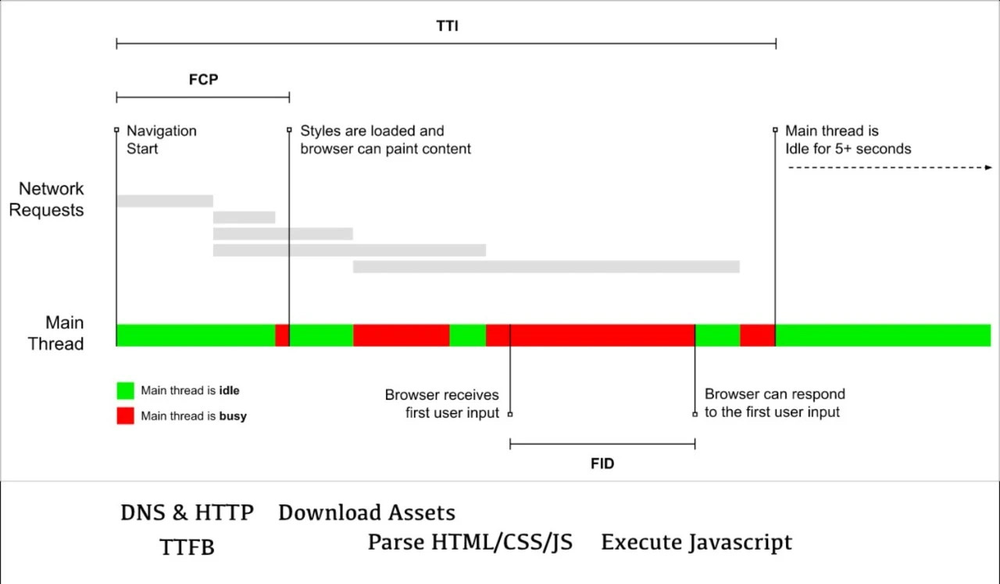

# 前端性能监控平台的搭建

本文从介绍前端中重要的性能指标开始，逐步分析并搭建一个性能监控平台

在正式开始本文的内容前，我们先简单介绍下第三方的性能监控平台

* webpagetest.org
* Lighthouse
* SpeedCurve
* Google Analytics

## 性能指标

在我们了解重要的性能指标之前，我们先看下浏览器的加载过程，然后逐步分析其中的性能指标，具体如下：

上图中 Navigation Start 代表了浏览器收到了跳转网页的请求，可能是在地址栏中输入了网址并敲下了回车，也可能是点击了某个链接发生了跳转。从这个事件开始便是浏览器尝试去解析 DNS，服务器接收到请求并进行数据库查询或者相关操作并返回 HTML

上述过程中的一个重要指标就是 TTFB

* TTFB (Time To First Byte)

即从 Navigation Start 开始后你的浏览器接收到的第一个字节，意味着对于第一个请求必要的 DNS、HTTPS 握手结束，并且后端已经完成了相应操作返回了 HTML

一般如果 TTFB 的数据不理想通常就意味着后端应用程序需要优化了，可能是对网站进行静态化以减少数据库的压力，也可能是数据库查询出现瓶颈。更多细节可以通过 New Relic 这样的专业工具去分析

在浏览器接收到第一个字节后，下一个重要的里程碑便是 Start Render

* Start Render

这时候浏览器开始渲染了，但在浏览器加载渲染的过程中是有很多因素阻止浏览器进行渲染的，例如在 head 标签中嵌入 script 标签(没有 async/defer 的情况下)，又或者是你的 CSS 文件太大没有加载完成。Start Render 指标表明了用户现在开始能看到一些内容开始加载了，而不是一片纯白的屏幕

接下来要关注的就是对于我已经能看到的内容，是否可以做一些用户交互呢？比如点击一些按钮等。这时候就需要关注 First CPU Idle 这个指标了

* First CPU Idle 以及类似的 TTI (Time To Interactive)

First CPU Idle 是指第一次 CPU 空闲时间，通常浏览器会使用主线程来做页面布局、垃圾回收以及解析执行 JS 的工作。如果你的 JS 文件庞大，需要消耗 CPU 大量的时间来解析，那这个指标则可以很好的显示出这个问题。这时候你需要做的可能是减少 JS 文件的体积、删除无用的 CSS/JS 等

## 性能指标的统计

当我们收集了足够的指标数据时，我们可能会想要做一个漂亮的数据统计图。方便告诉别人你的网站加载速度如何。此时你可能会说，我的网站平均 2s 即可加载完毕。但平均 2s 这个数值可能并不能反映出真正的问题所在，有可能70%的用户都是在 1.8s 内加载完毕的，但是有 20% 的用户加载时间在 5s 甚至 8s。作为一个性能报表你可能更多的想要看到问题在哪而不是大家平均加载速度怎样。因此常见的性能统计报表有以下三个方法：

* 平均值: 即数据的平均值
* 中位值: 对数据进行排序，在总样本的 1/2 处所在的性能数据
* 第 95 百分位值: 95百分位值即对数据进行排序，找出第 95% 处的数据，通常这个数据都是整个数据集中垫底的数据，既能帮你放大问题所在还能让你体验到用户群中最“弱势”的用户感受（可能是设备性能不好或网络较差）。如果你能保持这个值的相对稳定和优化，那基本上代表了你的系统有较好的稳定性和性能

## 参考连接

[网站性能优化之度量篇](https://blog.liyaodong.com/posts/website-performance-metrics/)
