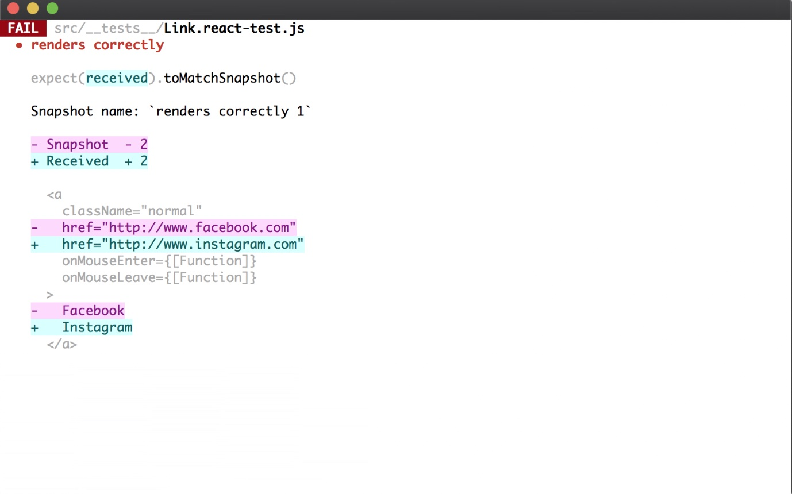

# react 中的单元测试

本文主要介绍 react 中的单元测试。

react 中的单元测试使用的是官方提供的 jest 框架，它不仅可以运行单元测试，同时还集成了断言库，快照测试，mock 等强大的功能，使单元测试变得十分容易。

## jest 测试框架

### 基本概念

在单元测试中有几个基本的概念，如下：

* 测试 case
* 测试套件
* 断言

**测试 case**: 通常一个测试 case 对应一个测试功能点，它使用 test 或者 it 的 API 来实现，例子如下：

```js
test('case 1', () => {
    // 你的测试主体
})
it('should renders without crash', () => {
    // 你的测试主体
})
```

其中 it 和 test 是一样的，或者说 it 就是 test 的一个别名。一般根据测试的名字来决定使用 test 还是 it，使其语义更明确。比如上例中的 "test -> case 1" 和 "it -> should renders without crash"

**备注**: 当有很多个 test case 的时候，如果想只运行某个 test case 的话，可以加上 only 参数，当然，可以在多个 test case 上面添加  only 参数:

```js
// 只运行下面这个 test case
test.only('test only', () => {

})
// ... 其他测试并不会运行
```

**测试套件**: 测试套件就是很多个测试 case 的合集，把很多个测试 case 用一个测试套件合并的话，可以针对这个测试case 做统一的操作。就好比是一个函数作用域。（describe 好比一个函数，里面的 test 则是一个个变量）如下：

```js
// 此处的是作用于本文件中所有的 test case
beforeEach(() => {
    return initializeFoodDatabase()
})

describe('test suite 1', () => {
    // 作用于 case 1 以及 case 2
    beforeEach(() => {
        return initializeFoodDatabase();
    })
    test('case 1', () => {})
    test('case 2', () => {})
})
describe('test suit 2', () => {
    // 作用于 case 3 以及 case 4
    beforeEach(() => {
        return initializeCityDatabase();
    })
    test('case 3', () => {})
    test('case 4', () => {})
})
```

**断言**: 断言就是组成测试主体的部分，它可以用来断言某个函数的输出是否符合预期，用法如下：

```js
test('sum(1, 1) to 2', () => {
    expect(sum(1, 1)).toBe(2)
})
```

上例中的 expect 是一个期望器，而 toBe 就是一个匹配器。所以上述这行代码的意思就是期望 sum(1, 1) 函数返回 2。

通常 expect 中进行一些操作，比如函数调用，dom 操作等，而后面的匹配器中（本例中的 toBe）则包含操作的结果。这种 ```expect().toBe()``` 的结构语义性还是非常明显的，便于阅读和维护。

当然，除了这里的 toBe 匹配器以外，还有其他的匹配器，详见下一章。

### 常用的断言

一些常用断言如下：

```js
expect(1 + 1).toBe(2) // 精确匹配
expect({a: 'test'}).toEqual({a: 'test'}) // 非精确匹配, 注意和上述的 toBe 的区别
```

### 快照测试

快照测试能有效的保证我们的组件 UI 结构统一，是一种低成本快速测试组件 UI 结构的方法。它的本质是将 React 组件转换成字符串并存在 \_\_tests\_\_ 文件夹中，当下一次运行到快照测试的时候，就将本次快照测试与之前保存的快照进行比对，如果有问题，则报错。

当然，如果你需要更新快照，则根据 test 的交互更新一下即可。此时你文件夹中保存的快照就是更新后的快照了。一个简单的快照测试例子如下：

```js
import React from 'react';
import Link from '../Link.react';
import renderer from 'react-test-renderer';

it('renders correctly', () => {
  // 快照测试不一定非要用 render.create(), 可以使用任何能生成字符串，并能代表组件结构的函数即可，比如下面会讲到的使用 enzyme 的 mount 函数来进行快照测试会更加的准确，也能避免很多坑，因为 renderer.create() 只是 node 的运行环境，而不是真实的浏览器环境，因此组件中很多和浏览器相关的它都会报错
  // 而使用 mount 进行快照测试的话，则可以避免上述问题
  const tree = renderer
    .create(<Link page="http://www.facebook.com">Facebook</Link>)
    .toJSON();
  // const tree = mount(<Link />).html() 使用 enzyme 进行渲染并输出 html 结构，变成字符串后方便保存为快照
  expect(tree).toMatchSnapshot();
})
```

当我们首次运行上述测试的时候，jest 会在我们的 \_\_tests\_\_ 目录下生成一个快照文件。

内容如下：

```js
exports[`renders correctly 1`] = `
<a
  className="normal"
  href="http://www.facebook.com"
  onMouseEnter={[Function]}
  onMouseLeave={[Function]}
>
  Facebook
</a>
`
```

当我们后续在运行该测试时，会将当前运行的和之前保存下来的快照进行比对。如果不同，则会输出前后两次的快照 diff 信息。这里假设我们第二次运行测试的时候，将代码修改了，如下：

```js
it('renders correctly', () => {
  const tree = renderer
    .create(<Link page="http://www.instagram.com">Instagram</Link>)
    .toJSON();
  expect(tree).toMatchSnapshot();
})
```

那么此时快照测试就会报错，如下：



当然，你也可以将之前保存的快照更新到最新的快照。

**注意:** 快照测试本质是一种将对象转换为字符串再进行字符串的对比测试，它并不会像浏览器那样将整个 react 组件渲染出来，也就是样式是不会真实的渲染出来的。同时，一些 dom 等逻辑操作也没法测试出来。

### mock 函数

jest 测试框架中也提供了 mock 功能。mock 功能类似一个黑盒子，它可以通过自定义输入输出快速的复制一个函数。一个简单的示例如下：

```js
test('mock test', () => {
    const myMock = jest.fn() // 通过 jest.fn 来创建 mock 函数
    console.log = myMock // 将 console.log 这个函数使用我们自己的 myMock 函数替代
})
```

## DOM 操作测试 -- enzyme

上文说到快照测试只能保证你的组件结构前后统一，但并不能测试 dom 操作，比如用户输入等操作。要测试 dom 操作，我们这里还需要借助另外一个测试库：enzyme

enzyme 是一个十分方便测试 react 的组件输出的 js 库。它的 API 设计模仿了 jQuery 的链式操作，因此使用方便。

简单来说，enzyme 是一个能渲染你的 react 组件，并能够方便的进行 dom 操作的测试工具库。

enzyme 中对于 react 组件的渲染，主要分为浅渲染（shallow）和完整的 DOM 渲染两种（mount）

### 浅渲染（shallow）

Shallow Rendering （浅渲染）指的是，将一个组件渲染成虚拟 DOM 对象，但是只渲染第一层，不渲染所有子组件，所以处理速度非常快。它不需要 DOM 环境，因为根本没有加载进 DOM。它可以用于简单的冒烟测试

一个使用示例如下：

```js
it('renders an `.icon-star`', () => {
    const wrapper = shallow(<MyComponent />)
    expect(wrapper.find('.icon-star')).to.have.lengthOf(1)
})
// 简单的冒烟测试
it('renders without crashing', () => {
  shallow(<App />);
})
```

### 完整 DOM 渲染（mount）

mount 方法用于将 React 组件加载为真实 DOM 节点，包括其中的所有子节点。

```js
describe('Enzyme Mount', function () {
  it('Delete Todo', function () {
    let app = mount(<App/>)
    let todoLength = app.find('li').length
    app.find('button.delete').at(0).simulate('click')
    expect(app.find('li').length).to.equal(todoLength - 1)
  })
})
```

### 常用 API

这里只介绍 mount 的常用 API，shallow render 的 API 类似，具体可查看官网：

```js
mount(node[, options]) => ReactWrapper // 返回 ReactWraper 类型的数据

// 下面是一些常用的 ReactWrapper API
.find(selector) => ReactWrapper // 返回由 selector 选择器选中的所有的 ReactWrapper 元素
.simulate(event[, mock]) => ReactWrapper // 在当前 node 上模拟一个事件
.debug() => String // 返回一个代表当前渲染树的字符串，在调试的时候经常会用到
```

## 在 vscode 调试单元测试

Visual Studio Code 支持调试 Jest 测试。

使用以下 launch.json 配置文件

```js
{
  "version": "0.2.0",
  "configurations": [
    {
      "name": "Debug CRA Tests",
      "type": "node",
      "request": "launch",
      "runtimeExecutable": "${workspaceRoot}/node_modules/.bin/react-scripts",
      "args": [
        "test",
        "--runInBand",
        "--no-cache"
      ],
      "cwd": "${workspaceRoot}",
      "protocol": "inspector",
      "console": "integratedTerminal",
      "internalConsoleOptions": "neverOpen"
    }
  ]
}
```

## 参考链接

[jest](https://jestjs.io/docs/zh-Hans/getting-started)

[enzyme](https://airbnb.io/enzyme/)

[vscode 调试单元测试](https://www.html.cn/create-react-app/docs/running-tests/)

[测试入门--阮一峰](http://www.ruanyifeng.com/blog/2016/02/react-testing-tutorial.html)
