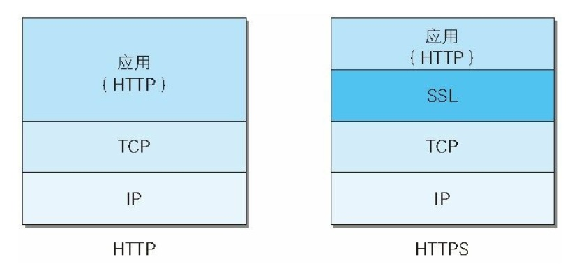
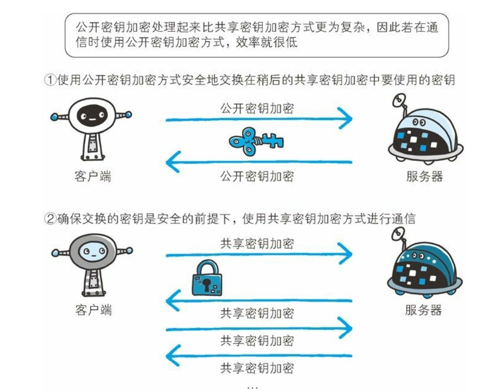
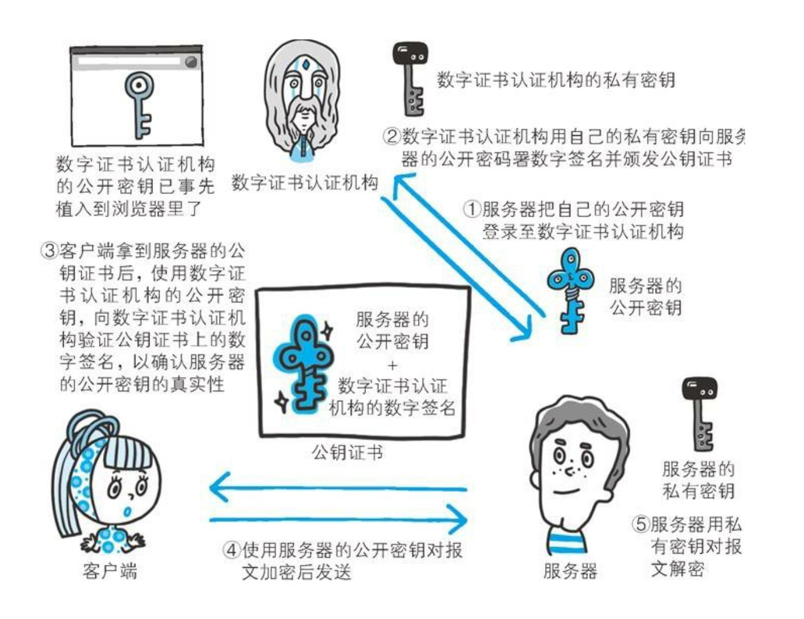
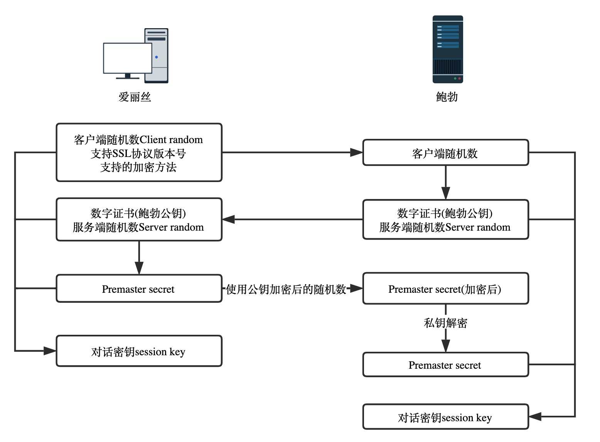

# SSL 协议

HTTP 协议具有优秀和方便的一面，然而它还存在着以下几个不足：

* 通信使用明文，内容可能被窃听
* 不验证通信双方的身份，因此有可能遭遇伪装
* 无法证明报文的完整性，所以有可能已遭篡改

为了解决上述的几个问题，人们提出了几个方案，其中 SSL （Socket Secure Layer: 安全套接层）或者 TLS （Transport Layer Security: 安全传输层协议, TLS 是基于 SSL 的升级优化）就是目前很常用的一种方案

```text
HTTP + SSL = HTTPS // HTTP + 加密 + 认证 + 完整性保护
```

现在最常见的 HTTPS 就是 HTTP + SSL 的组合。**注意**: HTTPS 并不是一个新的协议，而是 HTTP 与 TCP 之间添加了一个 SSL 中间协议，所以 HTTPS 其实就是身披 SSL 协议的 HTTP，如下图：



## 加密方式

在实际讲解 SSL 之前，我们先来了解下加密方式。SSL 采用了非对称加密方式（公开密钥方式）

近代的加密方法中，加密算法是公开的，而密钥是保密的，通过这种方式来保证加密方法的安全性。而根据密钥是否公开，加密算法主要分为以下两种方式：

* 对称加密 (共享密钥)
* 非对称加密 (公开密钥)

**对称加密**: 对称加密就是指加密和解密是使用同一个密钥来进行的，使用这种方式的话，一旦密钥落入第三方手中，那么它就可以进行解密了

**非对称加密**: 非对称加密中有公钥和私钥之分。其中用公钥加密的内容需要私钥来解密，用私钥加密的内容，需要用公钥进行解密。因此客户端和服务器之间可以传输彼此的公钥，以及用公钥加密的内容，在用各自的私钥进行解密就可以了。即使第三方拿到了公钥也没办法解密内容

从上面我们知道，对称加密更加简单，但存在着密钥被盗取的可能性，因此安全性较低，而非对称加密安全性较高，但比较复杂和耗时

在 HTTPS 的建立过程中，同时使用了非对称加密和对称加密这两种方式，在保证安全的前提下，最大的提高了通信的效率。具体的做法是：在交换双放密钥的过程中，使用了非对称加密的方式传输，之后的通信建立阶段则使用对称加密的方式，其中对称加密的密钥就是通过一开始的非对称加密的方式传输的，如下：



## 服务器身份的验证

虽然上述中使用非对称加密的方式看起来已经非常的安全了，但假如是第三方冒充服务器，将自己的公钥发给客户端，然后客户端用这个公钥加密内容并发回去，这样第三方就可以用自己的私钥来解密内容了。这个问题的本质是客户端没法认证对方的公钥是否是目标服务器发来的，还是被第三方恶意篡改过的

为了解决上述问题，于是出现了数字证书（CA：Certificate Authority）和其相关机构颁发的公开密钥证书，数字证书大概包含以下内容：

* 签发证书的机构
* 服务器的加密算法
* 服务器所使用的 Hash 算法
* 服务器的公钥
* 证书到期时间
* 其他

为了防止有人对证书内容进行修改，有了一个**数字签名**的概念，所谓的数字签名就是把以上所有内容做一个 Hash 操作，得到一个固定长度然后再给申请方，也就是服务器。当然，为了防止别人拿到这个证书后，修改内容并生成新的 Hash 值，CA 机构在颁发这个证书的时候会用自己的私钥将 Hash 值加密，从而防止了证书被篡改

所以对服务器身份认证的整个流程如下：

**申请阶段**： 首先服务器会向 CA 机构提出公开密钥的申请，CA 机构在判定申请者身份以后，会对已申请的公开密钥做数字签名（根据内容生成 Hash，同时用自己的私钥进行加密），然后分配这个公开密钥，并将该公开密钥放入公钥证书后绑定在一起

**使用第一步**：客户端第一次请求服务器时，服务器会让客户端安装一个数字证书，这个证书内容主要就是 CA 机构的公钥，一般为了保证安全，会事先在浏览器中植入常用认证机构的公钥

**使用第二步**：服务器发送来的 CA 机构颁发给自己的数字证书，客户端通过第一步中已经得到的公钥解密 CA 用私钥加密的 Hash-a，然后在用传过来的 HASH 算法生成一个 Hash-b，如果 Hash-a === Hash-b，认证通过，说明发送方确实是服务器

上述流程如下图所示：



以上就是客户端利用数字证书验证服务器身份的流程，当然了，客户端同样也可以申请数字证书来表明自己的身份，这里就不展开了

## SSL 协议的握手过程

1. 客户端给出支持 SSL 协议版本号，一个客户端生成的随机数（Client random，第一个随机数），客户端支持的加密方法等信息
2. 服务器接收到信息后，确认双方使用的加密算法，并返回数字证书，一个服务器生成的随机数（Server random，第二个随机数）等信息
3. 客户端确认证书有效性，然后生成一个新的随机数（Premaster secret），然后使用数字证书中的公钥进行加密这个随机数，发送给服务器
4. 服务器使用自己的私钥来解密（第3，4步就是非对称加密）
5. 客户端和服务器通过约定的加密算法（通常是 AES 算法），使用前面三个随机数生成对话密钥，用来加密接下来的通信内容

上述的流程如下图所示：



## 参考资料

[SSL协议之数据加密过程详解](https://juejin.im/post/5a48e397f265da43284133a6#comment)

《图解 HTTP》

[完全吃透 TLS/SSL](https://juejin.im/post/5b305758e51d4558ce5ea0d9)
