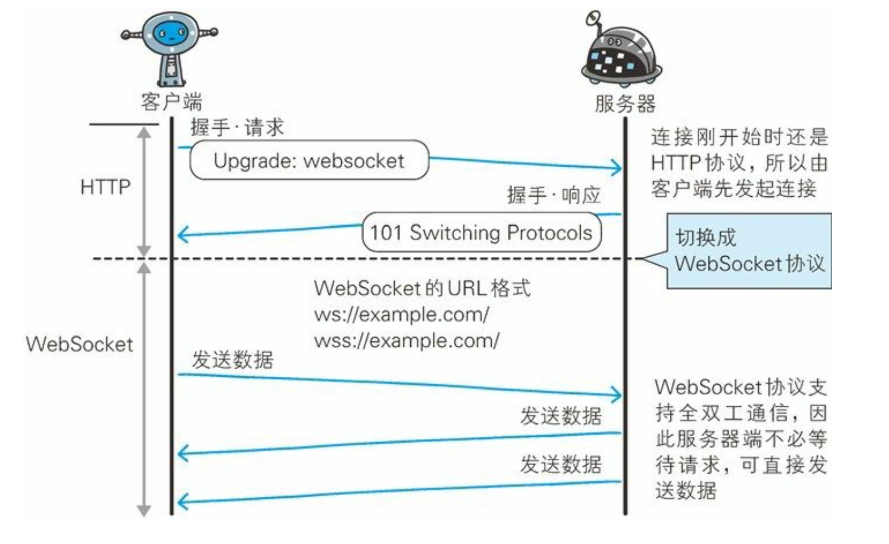

# Websocket 协议

websocket 是一种全双工通信协议，与2011年12月11日，被正式定位标准

## Websocket 协议的握手过程

为了实现 websocket 通信，需要用到 HTTP 的 Upgrade 首部字段来升级协议，一个完整的 websocket 协议握手过程如下：

1. 浏览器发送 HTTP 请求，同时 Upgrade 字段值为 websocket。一个请求事例如下：

    ```text
    GET /chat HTTP/1.1
    Host: server.example.com
    Upgrade: websocket
    Connection: Upgrade
    Sec-WebSocket-Key: dGhlIHNhbXBsZSBub25jZQ==
    Origin: http://example.com
    Sec-WebSocket-Protocol: chat, superchat Sec-WebSocket-Version: 13
    ```

    其中 Sec-WebSocket-Key 字段内记录着握手过程中必不可少的键值
    Sec-WebSocket-Protocol 字段内记录使用的子协议。子协议按照 WebSocket 协议标准在连接分开使用时，定义那些连接的名称
2. 服务器接收到请求后，返回 101 响应，表示握手成功，后续双放就切换到 websocket 协议进行数据的通信。一个 101 响应事例如下：

    ```text
    HTTP/1.1 101 Switching Protocols
    Upgrade: websocket
    Connection: Upgrade
    Sec-WebSocket-Accept: s3pPLMBiTxaQ9kYGzzhZRbK+xOo= Sec-WebSocket-Protocol: chat
    ```

    Sec-WebSocket-Accept 字段是由握手请求中的 Sec-WebSocket-Key 的字段值生成的

这里使用一张图来表示上述的握手流程：



## 参考资料

《图解 HTTP》
