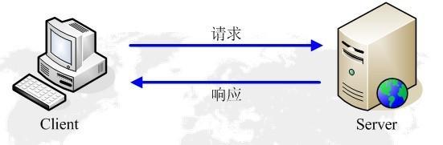

# http 协议

HTTP 协议是 Hyper Text Transfer Protocol（超文本传输协议）的缩写，是用于从万维网服务器传输超文本到本地浏览器的传送协议。

http 是一个典型的请求-响应模型，如下：



http协议是一种无状态协议。无状态是指对事物处理没有记忆能力，也就是这次的 http 请求和上次的 http 请求没有任何关系。当然可以通过 cookie 来帮助服务器识别请求客户端的身份（详见后文）。

## URL

说到 URL，首先要明确一个概念，就是 URI。URI 是 Uniform Resource Identifiers （统一资源标识符）的缩写。因为 http 可以从服务器上获取各种类型的资源，所以需要对每个资源都需要有一个唯一的标识符，这就是 URI，类似于 id 号，用来表示资源的身份的。

而 URL 就是 URI 的一种，它是 Uniform Resource Location （统一资源定位符）的缩写，也就是用资源在服务器的路径来作为该资源的唯一标识符，是一种常用的方法。

由上面两个定义我们知道了 URI 是一种更加广泛的定义，而 URL 其实是 URI 的一种实现，或者说是一种子集。也就是 URL 肯定是 URI 的一种，但 URI 不一定是 URL，比如 URI 中还有 URN 等等表示方法。

一个常见的 URL 格式如下：

```text
http://www.aspxfans.com:8080/news/index.asp?boardID=5&ID=24618&page=1#name
```

从上面的 URL 可以看出，一个完整的 URL 包含以下几个部分：

* 协议部分：也就是开头的 http，表示该网页使用的是 http 协议，当然也可以使用 ftp，https，wss 等协议。协议后面加用 '//' 作为分隔符
* 域名部分：www.aspxfans.com 就是域名，当然也可以使用 ip 地址作为域名 （涉及到 DNS 解析，见后文）
* 端口号：8080 就是端口号，一般跟在域名的后面用 ':' 分割，当没有指定端口号的时候，默认使用 80 端口
* 虚拟目录：从域名后的第一个 '/' 开始到最后一个 '/' 位置，是虚拟目录部分，它也是 URL 中必须的部分，表示资源在服务器上所在的路径，本例中是 '/news/'
* 文件名：虚拟目录后面跟的就是文件名，本例中就是 index.asp
* 参数部分：从 ? 开始到 # 结束的中间部分都是查询参数，以 key=value 的形式存在，多个参数中间用 & 分割。对于英文字母和数字则直接原样发送，对于空格，则转换成 +，对于中文或者其他字符，则使用 base64 进行转码，比如 %E4%BD 这种，E4就是转码后 16 进制 ASCII 码
* 锚部分：从 # 开始到最后都是锚部分，本例中是 name。规范中明确说明锚部分是不会随请求一起发送的，在浏览器中也是这样实现的，通常锚可以用于前端页面的滚动，或者前端的 Hash 路由就是基于锚这个特性实现的

## HTTP 之请求 Request

客户端发送一个 HTTP 请求到服务器的消息格式包含以下四个部分：**请求行**、**请求头部**、**空行**、和**请求数据**，如下图：


其中请求行是以一个方法符号开头，以空格分开，后面跟着请求的 URI和协议版本。一个 GET 请求的例子如下：

```text
GET /562f25980001b1b106000338.jpg HTTP/1.1
Host    img.mukewang.com
User-Agent    Mozilla/5.0 (Windows NT 10.0; WOW64) AppleWebKit/537.36 (KHTML, like Gecko) Chrome/51.0.2704.106 Safari/537.36
Accept    image/webp,image/*,*/*;q=0.8
Referer    http://www.imooc.com/
Accept-Encoding    gzip, deflate, sdch
Accept-Language    zh-CN,zh;q=0.81
```

从上述例子可以看到，第一行就是请求行，后续跟着第二部分也就是请求头，如 Host, User-Agent, Accept 等。第三部分是空行，这里需要注意，即使没有第四部分的请求数据，第三行也是需要的。第四部分就是请求数据，这里是 GET 请求，因此请求数据为空。

下面是一个 POST 请求的例子，我们可以看到 POST 请求中，包含了第四部分的请求数据：(注意请求头于请求数据之间的空行)

```text
POST / HTTP1.1
Host:www.wrox.com
User-Agent:Mozilla/4.0 (compatible; MSIE 6.0; Windows NT 5.1; SV1; .NET CLR 2.0.50727; .NET CLR 3.0.04506.648; .NET CLR 3.5.21022)
Content-Type:application/x-www-form-urlencoded
Content-Length:40
Connection: Keep-Alive

name=Professional%20Ajax&publisher=Wiley
```

POST 请求是将数据放在消息主体中的，服务器根据请求头中的 Content-Type 字段来获取消息主体的编码方式，进而进行解析数据。以下说明在请求中的几种常用的 Content-Type 类型。

**1. application/x-www-form-urlencoded**:

最常见的 POST 提交数据的方式，原生的 Form 表单，如果不设置 enctype 属性，那么默认就是 application/x-www-form-urlencoded 方式提交数据。

首先，Content-Type 被设置为 application/x-www-form-urlencoded，其次，提交的表单数据会转换为键值对并按照 key1=val1&key2=val2 的方式进行编码，key 和 val 都进行了 URL 转码(encodeURIComponent, decodeURIComponent)。例如在 jQuery 中，Content-Type 默认值就是 "application/x-www-form-urlencoded;charset=utf-8"

**2. multipart/form-data**:

另一种常见的 POST 数据提交方式，Form 表单的 enctype 设置为 multipart/form-data，它会将表单的数据处理为一条消息，以标签为单位，用分隔符（boundary）分开，类似我们上面的 Content-Type 中的例子（只是这时候的分隔符不再是 &，而是 boundary）。

采用这种方式，既可以上传键值对，也可以上传文件，甚至多个文件。当上传的字段是文件的时候，会有 Content-Type 来说明文件类型。Content-disposition 用来说明字段的一些信息。每部分都是以 --boundary 开始，紧接着是内容描述信息，然后是回车，最后是字段具体内容（字段、文本或二进制等）。如果传输的是文件，还要包含文件名和文件类型。消息主体以 --boundary-- 结束。

下面是上传一个文件的 POST 请求，假设我们要发送一个图片文件，文件名为“kn.jpg”：(对于多个文件，直接用 boundary 隔开就行了）

```text
POST/logsys/home/uploadIspeedLog!doDefault.html HTTP/1.1 
Accept: text/plain, */*
Accept-Language: zh-cn
Host: 192.168.24.56
Content-Type:multipart/form-data;boundary=-----------------------------7db372eb000e2
User-Agent: WinHttpClient
Content-Length: 3693
Connection: Keep-Alive
-------------------------------7db372eb000e2
Content-Disposition: form-data; name="file"; filename="kn.jpg"
Content-Type: image/jpeg
(此处省略jpeg文件二进制数据...）
-------------------------------7db372eb000e2--
```

**3. application/json**:

这种格式表示消息主体是序列化后的 JSON 字符串。使用 JSON 字符串的一个好处就是可以支持比较复杂的结构化数据，这也让它越来越流行

**4. text/xml**:

在 JSON 出现之前，text/xml 是业界的一大标准，只是现在慢慢的被 JSON 替代了

**5. binary(application/octet-stream)**:

二进制文件类型，如 application/pdf，指定了特定二进制文件 MIME 类型。对于 text 文件类型，若没有特定的子类型，就使用 text/plain。相应的，如果二进制文件没有特定类型，则使用 application/octet-stream

## HTTP之响应 Response

一般来说，服务器接收并处理客户端的请求后会返回一个 HTTP 的响应消息。和上文的请求结构一样，响应也由四部分组成：**状态行**、**消息报头**、**空行**和**响应正文**。


## HTTP 状态码

1xx: 指示信息--表示请求已经接收，继续处理
2xx: 成功--表示请求已经被成功接收、理解、接受
3xx: 重定向--要完成请求必须进行更进一步的操作
4xx: 客户端错误--请求有无法错误或者无权限等
5xx: 服务器端错误--服务器未能实现合法的响应

常见状态码:

200 OK // 客户端请求成功
301 Redirect // 重定向，资源永久性的移动了，浏览器自动跳转到新的 url，同时会保存新的 url
302 Redirect // 重定向，资源临时移动了，浏览器自动跳转到新的 url，下载新内容，但还是保存旧的 url
400 Bad Request // 客户端请求语法有错误
401 Unauthorized // 请求未授权
403 Forbidden // 禁止
404 Not Found // 找不到资源
500 Internal Server Error // 服务器发生错误
503 Server Unavaliable // 服务器档当前不能处理客户端的请求

## 浏览器中输入 url 后发生的事情

**1. DNS 域名解析**:

域名系统（Domain Name System）是互联网的一项服务。它作为将域名和 IP 地址互相映射的一个分布式数据库，能够使人更方便的浏览访问互联网。

DNS 域名解析的作用就是将域名解析成目的 IP 地址，假如 URL 中不含端口号，则使用协议默认的端口号。举个例子，www.google.com 作为google的网站，它的 ip 地址是 64.233.189.104，如果直接让用户在地址栏输入这个 ip 地址的话，用户肯定记不住，但像 www.google.com 这样的域名是很好记住的，所以用户可以在浏览器中输入 www.google.com 这个域名，DNS 会将它翻译成 64.233.189.104 然后发送，这就是 DNS 的作用。

在本地机器上配置网络时都会填写 DNS，这样本机就会把 URL 发送个和这个配置的 DNS 服务器，如果本机的 DNS 找不到的话，那么会将这个请求发送给上级的 DNS，一直到根目录。整个 DNS 是一个树状接口，如下图所示：


**2. 建立 socket 连接(TCP 3次握手)**:

socket 是对 TCP/IP 协议的封装，是一个调用接口（API），通过 socket 我们才能使用 TCP/IP 协议。

TCP 是一种面向连接的协议（UDP 是面向无连接的协议），而 HTTP 协议用到的正是 TCP 连接，所以在 HTTP 发送数据前需要先进行 TCP 的 3 次握手阶段，如下：


第一次握手：客户端发送连接请求，将 SYN 置为1，序列号 Seq 为 x，同时进入 SYN_SEND 状态，等待服务器的确认

第二次握手：服务器接收到 SYN 报文段，设置 Ack Number 为 x + 1，同时将 SYN 置为1，ACK 为 1，Seq 设置为 y，发送给客户端，同时自己进入 SYN_RECV 状态

第三次握手：客户端收到后，再次发送 ACK = 1， seq = x + 1， Ack Number 为 y + 1，同时进入连接建立状态。服务器收到后也进入连接建立状态。连接建立完成。接下来客户端可以发送数据了。

为什么需要三次握手：

如果只用一次握手的话，那么那些因为网络延迟或者其他原因导致失效的请求就有可能再次建立连接，浪费了资源，而使用三次握手，可以有效的避免这种情况

**3. 发起请求：向 IP 对应的服务器发送 HTTP 请求**:

在上述的 TCP 连接建立以后，就可以开始正式的请求了。请求包含请求行、请求头、空行和请求数据。详见上文，这里不展开了。

**4. 响应请求并传输数据**:

服务器接收到客户端请求后，会发送一个响应，同样的，一个响应包含状态行、消息报头、空行和响应体数据。详见上文，这里不展开了。

**5. 浏览器解析网页内容**:

关于浏览器的解析，详见 Browser/parse-html.md

**6. 连接结束(TCP 4次挥手)**:

当数据传送完毕时，需要断开 TCP 连接，这时候就有一个 4 次挥手的过程，如下：


第一次挥手：客户端发送 FIN=1，seq=u 的请求，同时进入 FIN-WAIT-1 的终止等待状态

第二次挥手：服务器接收到请求后，发送 ACK=1，seq=v，ack=u+1的请求，这时候客户端接收到这个请求后会进入 FIN-WAIT-2 的等待状态，同时服务器进行关闭操作，此时是 CLOSE-WAIT 状态

第三次挥手：服务器关闭后，又发送 FIN=1，ACK=1，seq=w，ack=u+1的请求，同时进入 LAST-ACk 的状态

第四次挥手：客户端接收到请求后，发送 ACK=1，seq=u+1，ack=w+1，同时等待 2 MSL 时间后，自己进行关闭，当然，服务器接收到这个请求后，也进入了关闭状态

为什么要四次：

TCP 是全双工通信模式，因此不仅要关闭客户端的，也要关闭服务器端的

为什么要等待 2 MSL：

MSL 是指报文最大生存时间。一是要保证 TCP 协议的全双工连接能够可靠关闭，而是要保证这次的连接的重复数据段从网络消失。

对于第一点，如果客户端直接关闭的话，那么最后发送出去的应答信号如果没到达服务器的话，服务器因为接收不到应答信号会重复发送 FIN=1，但此时客户端已经关闭，所以就接收不到了。因此，客户端需要等待时间，防止服务器因为收不到应答信号而重新发送 FIN=1请求

对于第二点，如果客户端close后，又发送一个新的连接，那么有可能新的连接的端口号和上一次的相同，导致滞留在网络中的老端口号的数据被当作新端口号的有效数据了。因此需要等待 2 MSL，这样就能保证所有数据都已经从网络中消失了。

## Cookie

http 是一个无状态协议，因此对于服务器来说，它是无法识别这个 http 请求到底是哪个客户端发送的。而像购物车等业务场景下是需要识别客户端的，因此 cookie 技术出现了（当然了，之前可以通过 token 或者隐藏表单域字段或者重写url等技术来实现）。

上面说了，cookie 是用来方便服务器识别请求的客户端身份的，它的具体实现如下：


如上图所示，首先客户端第一次像服务器发送请求的时候，服务器发会的响应中会携带设置 cookie 的头部字段，也就是 Set-Cookie，然后浏览器解析响应的时候，会根据 Set-Cookie 自动设置保存cookie。

接着下一次客户端请求的时候，就会带上这个 cookie，而服务器根据客户端带上来的 cookie，也就能识别客户端身份了。

我们可以看如下的一个实际的请求响应例子：


我们打开 chrome 浏览器的 application，可以看到存储着的 cookie：(此处是某一个网站的 Cookie 的实际值)


从上图中我们看到了 cookie 中也是有不同属性的，如下：

属性项 | 属性介绍
---- | ---
NAME=VALUE | 键值对，可以设置保存的 Key/Value, 这里 NAME 不能和其他属性名字一样
Domain | 生成 Cookie 的域名，不同域名下的 Cookie 不能共享
Path | 表示生成 Cookie 的路径
Expires/Max-Age | 设置 Cookie 的过期时间
HttpOnly | 设置是否只能用于 Http 请求
Secure | 设置加密，设置为 True 以后，只会在 https，ssl 等安全协议下传输该 Cookie

**Domain**:

不同域名下的 Cookie 是不能共享的。但是可以通过适当的设置从而首先不同子域名下的 Cookie 共享。现在我们假设有两个域名: 域名A - a.b.f.com.cn, 域名B - c.d.f.com.cn，显然 A 和 B 都是 f.com.cn 的子域名

假设我们在域名 A 中的 Cookie 的 domain 属性设置为 f.com.cn，那么 f.com.cn 及其子域名都可以访问这个 Cookie，即域名 A 和 B 都可以获取这个 Cookie

如果域名 A 和 B 同时设置 Cookie 的 domain 为 f.com.cn，那么这两个将出现覆盖现象

如果域名 A 没有显式设置 Cookie 的 domain 方法，那么 domain 就为 a.b.f.com.cn，这时域名 B 就无法获取 A 的Cookie 值

综上所示，我们知道了 Domain 的用处，可以根据这个特性来实现单点登陆

**Expires/Max-Age**:

这个字段是用来设置 Cookie 的有效期，也就是过期时间。一般浏览器的 Cookie 都是默认存储的，但随着浏览器的关闭，cookie 也就删除了，这就是 session 存储（会话存储）。

如果想长期保存 cookie 的话，那么就需要设置 Expires 或者 Max-Age 的值了。可以通过设置 Expires 为未来的一个时间点来保存 Cookie。

除了上面的 Expires，我们也可以设置 Max-Age。Max-Age 是以秒为单位的，当 Max-Age 为正数时， Cookie 会在 Max-Age 秒之后被删除；当 Max-Age 为负数时，表示是临时存储，不会产生 Cookie 文件，只会保存在浏览器内存中，且只会在打开的浏览器窗口或者子窗口内有效；而当 Max-Age 为0时，则会立马删除 Cookie，因为浏览器并没有删除 Cookie 的机制，所以它的实现就是让 Cookie 失效

**HttpOnly**:

当这个属性设置为 True时，就不能通过 js 脚本来获取 cookie 的值了，也就是 document.cookie 无法获取cookie的内容。

## Session

Session 也就是会话，是代表客户端于服务器的一次会话过程。通常和 Cookie 共同实现 http 的状态保存。

Session 不同于 Cookie 的是，Session 是保存在服务器端，而 Cookie 是保存在浏览器中。并且 Cookie 大小有限制，不能超过 4k，而 Session 可存储的数据远远高于 Cookie。

Session 和 Cookie 的合作方式如下：


根据上图我们可以知道，当浏览器第一次请求的时候，服务器会创建此次的 Session 会话，同时返回一个 SessionID（这里会将 SessionID 的值保存在 Cookie 中）。当浏览器接收到这个请求后，保存 Cookie ，也就是 SessionID 的值，在第二次请求的时候会带上这个 Cookie，服务器从 Cookie 中取到 SessionID，并根据这个值来从数据库中获取用户的详细信息。

根据以上流程可知，SessionID 是连接 Cookie 和 Session 的一道桥梁，因为只需要保存一个 ID 值，所以可以有效的缓解 Cookie 存储压力，大部分系统也是根据此原理来验证用户登录状态。

当然了，Cookie 是可以被本地浏览器禁止的，那么当 Cookie 被禁止后，又如何保证整个机制的正常运行呢。

**第一种方案是 URL 重写技术，即在请求的地址后面拼接**:

```js
// 作为url附加路径
'http://..../xxx;jsessionid=abcdefjijeoijoifjioe'
// 作为查询字符串
'http://..../xxx?jsessionid=abcdefjijeoijoifjioe'
```

**第二种方案是 Token 技术**:

略

**第三种方案是表单的隐藏字段**:

略

## Token

在说明 Token 之前，我们先来讨论下上述的 Session 和 Cookie 存在的一些问题：

1. Session 会在每次用户发起请求的时候，服务器都要取创建一个记录来存储信息。当用户量增多的时候，内存开始也会不断的增加
2. 扩展性问题。由于 Session 的保存，要想增减服务器，也带来一定的困难
3. CORS 问题，也就是跨域资源共享问题。由于 Cookie 无法跨域，因此基于 Cookie 的 Session 也无法解决多个移动设备数据共享跨域问题
4. CSRF 问题，容易受到跨站请求伪造的攻击

在了解了上述的 Session 和 Cookie 登陆的问题之后，现在我们来看下 Token 的验证方式。基于 Token 的身份验证是无状态的，我们不需要将用户信息保存在服务器中。这种不需要保存 Session 信息的方式，可以很方便的增减服务器，而不用担心用户是否已经登陆。

### 基于 Token 的身份验证过程

1. 用户通过用户名和密码发送请求
2. 服务器端程序验证
3. 服务器端程序返回一个带签名的 token 给客户端
4. 客户端存储 Token，并且每次访问都携带 Token 到服务器端
5. 服务器验证 Token，校验成功则返回请求数据，校验失败则返回错误码

以上过程如下图所示：


### Token 的优势

* 无状态、可扩展

在客户端存储 Token 是无状态的，可以随时扩展

* 安全性

请求中发送 token 而不是发送 cookie，能够防止 CSRF

* 可扩展性
* 多平台跨域

### Token 有效期

由于用户名和密码一般也是需要定期更换，以及 SSL 安全正书也是有有效期限的，所以 Token 肯定也需要设置有效期。具体时长则根据系统安全需要，尽可能短，但不能影响到用户体验

现在我们考虑一种情况，就是用户在操作的过程中，token 过期失效了，要求用户重新登陆，这种用户体验就很不好了。该怎么解决这个问题呢？

一种比较好的解决方式是同时使用 Token 和 Refresh Token，当 Token 过期的时候，前端发送 Refresh Token 请求服务器刷新 Token 即可，当然了，Refresh Token 也是有过期时间的，只是可以设置长一点，比如按天为单位，当 Refresh Token 也过期的话，那么就需要用户重新登陆了。他们的时许图如下：

1、前端首先登陆:


前端使用用户名跟密码请求首次登录

后服务端收到请求，去验证用户名与密码是否正确

验证成功后，服务端会根据用户id、用户名、定义好的秘钥、过期时间生成一个 Token，再把这个 Token 发送给前端

2、业务请求:


前端每次发送数据时，都会在请求头中携带 Token，服务器会根据这个 Token 进行实效的认证

3、Token 过期后刷新:


当服务器发现 token 过期后，会返回token过期的错误，此时浏览器会发送 refresh Token 的请求，如果refresh Token 没有过期，服务器会生成一个新的 token 给前端，前端带着这个新的 token 就可以继续的请求了，如果 refresh token 过期了的话，那么前端就要重新登陆了

### 服务器 Token 的认证

之前说了，token 是无状态的，也就是服务器不需要将 token 信息保存下来，直接认证即可。那么服务器到底是怎么认证 token 的呢？

其实只要保证这个 token 是自己签发的即可。对于通常的签名，一般都是一方签发，一方验证。但对于 token 都是服务器签发，服务器认证，所以这里直接采用简单的对称加密算法即可对客户端传上来的 token 进行验证。

因此，当 token 无状态以后，单点登陆就变得容易了。前端拿到一个有效的 token，它就可以在任何统一体系的服务上认证通过——只要它们使用同样的密钥和算法来认证 token 的有效性，如下：


当然了，如果 Token 过期了，前端仍然需要去认证服务器更新 Token：


## 参考资料

1. [关于HTTP协议，一篇就够了](https://www.cnblogs.com/ranyonsue/p/5984001.html#4426338)

2. [输入网址背后发生的那些事](https://blog.csdn.net/ViMan1204/article/details/89643900)

3. [HTTP请求中，几种常见的Content-Type类型](https://www.cnblogs.com/applezxy/p/11174137.html)

4. [http使用post上传文件时，请求头和主体信息总结](https://blog.csdn.net/wwlhsgs/article/details/45075327)

5. [把cookie聊清楚](https://juejin.im/post/59d1f59bf265da06700b0934#comment)

6. [深入分析Session和Cookie](https://juejin.im/post/5b7c1f4d6fb9a019f221ca14)

7. [你真的了解 Cookie 和 Session 吗](https://juejin.im/post/5cd9037ee51d456e5c5babca)

8. [session与登录机制](https://juejin.im/post/5af828e96fb9a07ab83e1f10)

9. [Token登录认证](https://juejin.im/post/5c9f5d62f265da308d50b865)

10. [Token 认证的来龙去脉](https://juejin.im/post/5a6c60166fb9a01caf37a5e5)