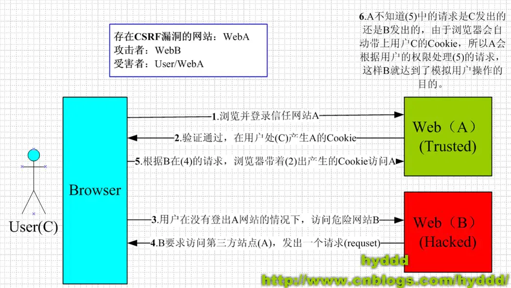

# 前端安全问题

## CSRF

### CSRF 简介

CSRF (Cross-site request forgery), 中文名称：跨站请求伪造，也被称为 one click attack/session riding, 缩写为 CSRF/XSRF

CSRF 攻击简单来说就是：攻击者盗用你的身份，以你的名义恶意发送请求。CSRF 能够做的事情包括：以你的名义发送邮件，发消息，盗取你的账号，甚至于购买商品，虚拟货币转账......造成的问题包括：个人隐私泄露以及财产安全

### CSRF 攻击原理



从上图中可以看出，要完成一次 CSRF 攻击，受害者必须依次完成以下两个步骤：

1. 登录受信任网站 A，并在本地生成 Cookie
2. 在不登出 A 的请情况下，访问危险网站 B

CSRF 的攻击类型主要有以下三种：

1. GET 类型的 CSRF
2. POST 类型的 CSRF
3. 链接类型的 CSRF

**GET 类型的 CSRF**

这类攻击很简单，只需要一个 HTTP 请求，如下：

```html

```

当受害者访问包含有这个 img 标签的网站时，浏览器会自动向 a.com 发送一次 HTTP 请求，同时，因为受害者已经登录 a.com 这个网站了，因此浏览器还会携带这个 Cookie 信息。而对于服务器来说，它并不知道这个请求是用户主动发送的，还是被动发送的，它只知道这个请求中携带了有效的 Cookie，因此就正常处理

**POST 类型的 CSRF**

这种类型的 CSRF 通常使用一个自动提交的表单，如：

```html
<form action="http://a.com/withdraw" method=POST>
    <input type="hidden" name="account" value="airing" />
    <input type="hidden" name="amount" value="10000" />
    <input type="hidden" name="for" value="hacker" />
</form>
<script> document.forms[0].submit(); </script>
```

同样的，当用户访问这个页面的时候，表单会自动提交，浏览器同样没法区别

**链接类型的 CSRF**

链接类型的 CSRF 攻击其实就是一个带有指定域名的 a 标签，当用户点击的时候，就会发送这个 HTTP 请求，如下：

```html
<a href="http://a.com/withdraw.php?amount=1000&for=hacker" taget="_blank">
    屠龙宝刀，点击就送！
</a>
```

### CSRF 防御方法

从上面的 CSRF 的攻击方式中我们可以知道，CSRF 的攻击本质上就是利用 Cookie 信息，这里需要注意一点：CSRF 攻击只是间接利用了 Cookie 信息，它是没法主动读取这个 Cookie 信息的，因为跨域下 Cookie 是读取不到的。而服务器只根据 Cookie 来判断用户操作也是 CSRF 能攻击的根源。

针对上述的两个特点，CSRF 的防御可制定以下两种防御策略：

1. 自动防御：阻止不明外域的访问
    * 同源检测
    * Samesite Cookie
2. 主动防御：提交表单时要求附加本域才能获取的信息
    * Synchrogazer Tokens
    * Double Cookie Defense
    * Custom Header

#### 同源检测

在 HTTP 协议中，每一个异步请求都会携带两个 Header，用来标记来源域名：

* Origin Header
* Referer Header

通过验证这两个 Header 是否受信任从而实现同源检测。但这种方法并不靠谱，因为攻击者可以隐藏甚至修改这两个字段

#### Samesite Cookie

为了从源头上解决这个问题，Google 起草了一份草案 来改进 HTTP 协议，那就是为 Set-Cookie 响应头新增 Samesite 属性，它用来标明这个 cookie 是个“同站 cookie”，同站 cookie 只能作为第一方 cookie，不能作为第三方 cookie。SameSite 有两个属性值，分别是 Strict 和 Lax。

* Samesite=Strict：严格模式，表明这个 cookie 在任何情况下都不可能作为第三方 cookie，绝无例外
* Samesite=Lax：宽松模式，比 Strict 放宽了点限制。假如这个请求是同步请求（改变了当前页面或者打开了新页面）且同时是个 GET 请求，则这个 cookie 可以作为第三方 cookie

但是 Samesite Cookie 存在着一些问题：

* Samesite 兼容性不好，现阶段除了最新版 Chrome 和 Firefox 支持外，其他还不支持
* Samesite 不支持子域。这样的话，当访问每个子域名时，用户都要重新登录

#### Synchrogazer Token

即同步表单的 CSRF 校验。服务器可以要求所有用户在提交表单的时候携带一个 CSRF 攻击者无法获取到的 Token，这样的话，在后续用户请求的时候，服务器通过校验请求中是否携带正确的 Token 来判断是否合法。具体分为以下三个步骤：

1. 将 CSRF Token 输出到页面中
2. 页面提交的请求携带这个 Token，通常隐藏在表单域中作为参数提交，或拼接在 URL 后作为 query 提交
3. 服务器验证 Token 是否正确

当用户从客户端得到了 Token，再次提交给服务器的时候，服务器需要判断 Token 的有效性，验证过程是先解密 Token，对比加密字符串以及时间戳，如果加密字符串一致且时间未过期，那么这个 Token 就是有效的

这种 Token 的值通常是使用 UserID、时间戳和随机数，通过加密的方法生成。这样的加密既能验证请求的用户、请求的时间，又能保证 Token 不容易被破解

这种方法要比之前检查 Referer 或者 Origin 要安全一些，Token 可以在产生并放于 Session 之中，然后在每次请求时把 Token 从 Session 中拿出，与请求中的 Token 进行比对

#### Double Cookie Defense

双重 Cookie 验证，我们可以利用 CSRF 不能获取用户 Cookie 的特点，在提交表单的时候携带一个 Cookie 值

此方法相对于 CSRF Token 就简单了许多。可以直接通过前后端拦截的的方法自动化实现。后端校验也更加方便，只需进行请求中字段的对比，而不需要再进行查询和存储 Token

但是它并没有被大规模应用，尤其在大型网站上，存在着严重的缺陷。举一个栗子🌰：

由于任何跨域都会导致前端无法获取 Cookie 中的字段（包括子域名之间），所以当用户访问我的 me.ursb.me 之时，由于我的后端 api 部署在 api.ursb.me 上，那么在 me.ursb.me 用户拿不到 api.ursb.me 的 Cookie，也就无法完成双重 Cookie 验证

因此，我们的 Cookie 放在了 ursb.me 主域名下，以保证每个子域名都可以访问。但 ursb.me 下其实我还部署了很多其他的子应用，如果某个子域名 xxx.ursb.me 存在漏洞，虽然这个 xxx.ursb.me 可能没有什么值得窃取的信息，但是攻击者可以修改 ursb.me 下的 Cookie，从而实现 XSS 攻击，并利用篡改的 Cookie 对 me.ursb.me 发起 CSRF 攻击

同时，为了确保 Cookie 传输安全，采用这种防御方式的最好确保用整站 HTTPS 的方式，如果还没切 HTTPS 的使用这种方式会有风险

## XSS

Cross-Site Script (跨站脚本攻击) 简称 XSS，是一种利用代码注入的攻击。攻击者通过在网上注入恶意脚本，使之在用户的浏览器上运行。利用这些恶意脚本，攻击者可以获取用户的敏感信息如 Cookie、SessionID 等，进而危害数据安全。为了和 CSS 进行区分，这里把第一个字母改成 X，于是就叫做 XSS

XSS 的本质是：恶意代码未经过过滤，与正常网站代码混在一起，浏览器无法区分哪些脚本是恶意的，导致恶意脚本被执行

通常由于输入长度的限制，注入的恶意脚本比较短，但恶意脚本可以通过引入外部脚本并由浏览器执行，来完成更加复杂的攻击策略

### XSS 攻击分类

根据攻击的来源，XSS 攻击可分为存储型、反射型和 DOM 型三种

| 类型 | 存储区* | 插入点* |
| --- | ------ | ------ |
| 存储型 XSS | 后端数据库 | HTML |
| 反射型 XSS | URL | HTML |
| DOM 型 XSS | 后端数据库/前端存储/URL | 前端 javaScript |

#### 存储型 XSS

存储型 XSS 攻击步骤如下:

1. 攻击者将恶意代码提交到目标网站的数据库中
2. 用户打开目标网站时，网站服务端将恶意代码从数据库中取出，拼接在 HTML 中返回给浏览器
3. 用户浏览器收到响应后解析执行，混在其中的恶意代码也被执行
4. 恶意代码窃取用户数据并发送到攻击者的网站，或者冒充用户，进行各种操作

这种攻击常见于带有用户保存数据的网站功能，如论坛发帖、商品评论、用户私信等

#### 反射型 XSS

反射型 XSS 攻击步骤如下:

1. 攻击者构造出特殊的 URL，其中包含恶意代码
2. 用户打开带有恶意代码的 URL 时，网站服务端将恶意代码从 URL 中取出，拼接在 HTML 中返回给浏览器
3. 浏览器接收到响应后解析执行，混在其中的恶意代码也被执行
4. 恶意代码窃取用户数据并发送到攻击者的网站，或者冒充用户的行为，调用目标网站接口执行攻击者指定的操作

反射型 XSS 跟 存储型 XSS 的区别是：反射型 XSS 的恶意代码是存在 url 中，而存储型 XSS 的恶意代码是存放在后端数据库中

反射型 XSS 漏洞常见于通过 URL 传递参数 的功能，比如网站搜索、跳转等

反射型 XSS 通常需要用户主动打开恶意的 URL 才能生效，所以攻击者往往会诱导用户点击

#### DOM 型 XSS

DOM 型 XSS 攻击步骤如下:

1. 攻击者构造出特殊的 URL，其中包含恶意代码
2. 用户打开带有恶意代码的 URL
3. 用户浏览器接收到响应后解析执行，前端 javaScript 取出 URL 中的恶意代码并执行
4. 恶意代码窃取用户数据并发送到攻击者网站，或者冒充用户进行各种操作

DOM 型 XSS 攻击和前两种 XSS 攻击的区别在于：DOM 型 XSS 攻击是由前端 javascript 执行，属于前端自身的漏洞，而另外两种则是服务器的安全漏洞

### XSS 预防

通过上述的介绍，我们知道了 XSS 攻击有两大要素：

* 攻击者提交恶意代码
* 浏览器执行恶意代码

而要避免 XSS 攻击，需要我们同时考虑用户输入，URL 传参，前端 javascript 执行等各方面

#### 预防存储型和反射型 XSS 攻击

存储型和反射型 XSS 攻击都是在服务端取出恶意代码后，插入到 HTML 中，然后返回给浏览器执行导致的安全漏洞。预防这两种漏洞，有两种常见的做法：

* 改成纯前端渲染，把代码和数据分开，也就是前后端分离的开发方式
* 对 HTML 做充分的转义

对于纯前端渲染的方式确实可以避免大部分风险，但还是存在 DOM 型 XSS 攻击的漏洞，见后续详解。而且对于性能要求高或者有 SEO 需求的页面来说，纯前端渲染不太适合

当使用 HTML 转义的方式的时候，我们需要知道对于不同的插入地方，需要不同的转义规则，下面是一个 Java 工程中的转义事例:

```html
<!-- HTML 标签内文字内容 -->
<div><%= Encode.forHtml(UNTRUSTED) %></div>

<!-- HTML 标签属性值 -->
<input value="<%= Encode.forHtml(UNTRUSTED) %>" />

<!-- CSS 属性值 -->
<div style="width:<= Encode.forCssString(UNTRUSTED) %>">

<!-- CSS URL -->
<div style="background:<= Encode.forCssUrl(UNTRUSTED) %>">

<!-- JavaScript 内联代码块 -->
<script>
  var msg = "<%= Encode.forJavaScript(UNTRUSTED) %>";
  alert(msg);
</script>

<!-- JavaScript 内联代码块内嵌 JSON -->
<script>
var __INITIAL_STATE__ = JSON.parse('<%= Encoder.forJavaScript(data.to_json) %>');
</script>

<!-- HTML 标签内联监听器 -->
<button
  onclick="alert('<%= Encode.forJavaScript(UNTRUSTED) %>');">
  click me
</button>

<!-- URL 参数 -->
<a href="/search?value=<%= Encode.forUriComponent(UNTRUSTED) %>&order=1#top">

<!-- URL 路径 -->
<a href="/page/<%= Encode.forUriComponent(UNTRUSTED) %>">

<!--
  URL.
  注意：要根据项目情况进行过滤，禁止掉 "javascript:" 链接、非法 scheme 等
-->
<a href='<%=
  urlValidator.isValid(UNTRUSTED) ?
    Encode.forHtml(UNTRUSTED) :
    "/404"
%>'>
  link
</a>
```

#### 预防 DOM 型 XSS 攻击

DOM 型 XSS 攻击实际上就是前端的 javascript 代码不够严谨，把不可信数据当作代码来执行了

在使用 .innerHTML、.outerHTML、document.write() 时要特别小心，不要把不可信数据作为 HTML 插入到页面上，尽量使用 .textContent, .setAttribute() 等

假如使用了前后端分离的框架，前端中使用了 Vue/React 等框架时，最好避免使用 v-html/dangerouslySetInnerHTML 功能，这样在前端的 render 阶段就避免了 innerHTML、outerHTML 的 XSS 隐患了

DOM 中的内联事件监听器，如 location、onclick、onerror、onload、onmouseover 等，\<a\> 标签的 href 属性，JavaScript 的 eval()、setTimeout()、setInterval() 等，都能把字符串作为代码运行。如果不可信的数据拼接到字符串中传递给这些 API，很容易产生安全隐患，请务必避免

```html
<!-- 内联事件监听器中包含恶意代码 -->


<!-- 链接内包含恶意代码 -->
<a href="UNTRUSTED">1</a>

<script>
// setTimeout()/setInterval() 中调用恶意代码
setTimeout("UNTRUSTED")
setInterval("UNTRUSTED")

// location 调用恶意代码
location.href = 'UNTRUSTED'

// eval() 中调用恶意代码
eval("UNTRUSTED")
</script>
```

#### 其他安全措施

* CSP: Content Secure Policy, 内容安全策略, 定义页面可以加载哪些资源
* HTTP-only Cookie: 禁止 JavaScript 读取某些敏感 Cookie，攻击者完成 XSS 注入后也无法窃取此 Cookie
* 验证码：防止脚本冒充用户提交危险操作

### XSS 攻击总结

XSS 攻击是一种通过注入恶意代码来窃取用户数据的攻击，它的本质是浏览器无法识别哪些脚本是恶意的

XSS 攻击即可以通过服务器后端的漏洞进行，也可以通过前端 javascript 的漏洞进行

## 网络劫持

网路劫持主要分为 HTTP 劫持与 DNS 劫持

**HTTP 劫持**: 大多数情况是运营商 HTTP 劫持，当我们使用了 HTTP 请求请求一个网站页面的时候，网络运营商会在正常的数据流中插入精心设计的网络数据报文，让客户端展示“错误”的数据，通常是一些弹窗，宣传性广告或者直接显示某网站的内容。HTTP 劫持又可细分为如下三类：

* iframe 类劫持：将正常页面嵌入 iframe 或者页面增加 iframe 页面
* 注入 js 类劫持：在正常页面注入劫持的 js 代码实现的劫持
* 篡改页面类劫持：正常页面出现多余的劫持网页标签，导致页面整体大小发生了变化

**DNS 劫持**: DNS 劫持就是劫持了 DNS 服务器，通过某些手段取得某域名的解析记录控制权，进而修改此域名的解析结果，导致该域名的访问由原 IP 地址转入到修改后的指定 IP
，其结果就是对特定的网址不能访问或访问的是假网址，从而实现窃取资料或者破坏原有正常服务的目的

DNS 劫持比之 HTTP 劫持 更加过分，简单说就是我们请求的是 http://www.a.com/index.html ，直接被重定向了 http://www.b.com/index.html

### HTTP 劫持

#### iframe 类劫持

网络运营商通常为了尽可能减少植入广告对原有网站页面的影响，通常会把原有网站页面放置到一个和原页面相同大小的 iframe 里面去，那么就可以通过这个 iframe 来隔离广告代码对原有页面的影响

这种情况下，我们只需要判断 window.self 和 window.top 是否相等就可以了

#### 注入 js 类劫持

这类劫持通常是利用某些标签具有执行 js 的能力而进行的劫持，下面列出一些常见的注入方式：

```html
<a href="javascript:alert(1)" ></a>
<iframe src="javascript:alert(1)" />

<video src='x' onerror="alert(1)" ></video>
<div onclick="alert(1)" onmouseover="alert(2)" ><div>
```

对于这类的 js 注入劫持，通常我们可以建立一个黑名单，然后对页面中的容易被劫持的标签进行筛选过滤

还有可能在原网页中注入外域 js 脚本链接来完成更复杂的劫持，因此对于不受信任的外域脚本，我们需要拦截该脚本的执行

#### 篡改类类劫持

这类的劫持通常较少，一般是在页面底部增加 div，展示一些非网站的内容。我们可以通过 MutationObserver 来监听页面中 DOM 的变化，做出适当的响应

### 劫持的防御

针对劫持的类型不同，我们有不同的防御方法，这里就不详细展开了。由于劫持的方法在不断的更新，因此我们劫持的防御也要与时俱进，所以需要建立一个上报系统，一旦监测到劫持，就上报给服务器，不仅可以让我们程序员第一时间得知攻击的发生，更可以让我们不断收集这类相关信息以便更好的应对。

## 参考资料

1. [前端安全系列 | CSRF](https://juejin.im/post/5d6945f3f265da03ab4264b8)

2. [前端安全系列（一）：如何防止XSS攻击？](https://juejin.im/post/5bad9140e51d450e935c6d64#comment)

3. [【前端安全】JavaScript防http劫持与XSS](https://www.cnblogs.com/coco1s/p/5777260.html)

4. [Web 前端页面劫持和反劫持](https://juejin.im/post/593df628da2f60006728cff2)
