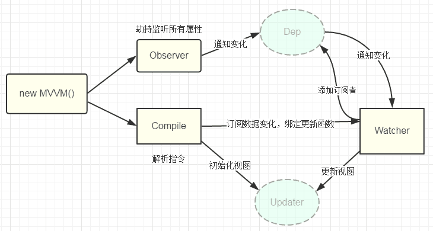

# Vue 中的数据双向绑定原理

本文通过手写一个简单的 MVVM 视图框架，实现数据变化后 DOM 能自动更新的功能，从而更好的理解 Vue 框架的内部运行机制

用过 Vue 的都知道，在 Vue 的使用过程中，只需要给相应的 DOM 标签绑定数据以后，DOM 的内容就能跟着数据自动更新了。我们可以简单想下，要实现这个功能，需要哪几个部分？

其实 DOM 的自动更新简单来讲就是一个"观察-订阅"模式。当数据更新的时候，通知订阅者修改依赖这些数据的 DOM 标签，从而实现了这种自动更新 DOM 的功能

所以要实现以上功能，需要有如下的几个模块：

* 能监听到数据变化的模块 (Observe)
* 将 DOM 标签和对应数据相关联的模块 (Compile)
* 当数据更新后，能通知 DOM 并进行相应更新的模块 (Watcher)
* 入口模块，将上述功能全部融合到一起 (MVVM)

上述几个模块之间的关系如下图：



接下来我们详细讲解各个模块的实现原理，完整代码在 mvvm 文件夹中

## Observer

Observer 模块的作用就是监听数据的变化。要想在数据变化后能自动更新 DOM，首先我们就需要监听到这个数据变化。js 中提供了 Object.defineProperty() 这个函数，能够实现数据的监听。具体用法可以查看 [MDN](https://developer.mozilla.org/zh-CN/docs/Web/JavaScript/Reference/Global_Objects/Object/defineProperty)，此处不再赘述

Observer 的实现相对简单，代码如下：

```js
function observe (data) {
  if (!data || typeof data !== 'object') {
    return
  }
  Object.keys(data).forEach(key => defineReactive(data, key, data[key]))
}

function defineReactive (obj, key, val) {
  // observe recursive
  observe(val)
  let dep = new Dep()
  Object.defineProperty(obj, key, {
    configurable: false,
    enumerable: true,
    get () {
      // 通过 Dep.target 来传递订阅者
      Dep.target && dep.addSub(Dep.target)
      return val
    },
    set (newVal) {
      if (newVal === val) {
        return
      }
      val = newVal
      observe(newVal)
      // 数据更新的时候通知订阅者
      dep.notify()
    }
  })
}

class Dep {
  static target = null
  constructor () {
    this.subs = []
  }
  addSub (sub) {
    this.subs.push(sub) 
  }
  notify () {
    this.subs.forEach(sub => sub.update())
  }
}
```

从代码中可以看出，就是使用 Object.defineProperty 来实现数据变化时的监听，同时我们又使用了 Dep 这个模块来保存订阅者，当数据有修改的时候，就调用 notify 来通知订阅者

这里需要注意的一个地方就是，我们是通过 Dep.target 这个全局变量来实现订阅的，同时在 get 数据的时候进行订阅，这样的话，在其他函数中只要设置 Dep.target 这个值，在访问这个数据，就能实现对这个数据的订阅

## Compile

在实现了 Observe 的基础上，接下来我们就需要将 DOM 标签与相关数据进行绑定了。这就是 Compile 的作用了

我们知道在 Vue 框架中，是通过一些列的指令来告诉框架 DOM 与这个数据的关联的，比如 v-bind，v-html 等，这里我们也同样采用这种指令的形式。Compile 的实现如下：

```js
// parse html
function compile (vm, el) {
  let dom = document.querySelector(el)
  if (!dom) {
    console.error(`invalid css selector: ${el}`)
    return
  }
  parseHTML(dom, vm)
}

function parseHTML (dom, vm) {
  dom.childNodes.forEach(node => {
    if (compileUtil.isTextNode(node)) {
      let text = node.textContent
      let reg = /{{\s*(\w*)\s*}}/
      let exp = reg.test(text) ? text.match(reg)[1] : ''
      compileUtil.bindTextNode(node, vm, exp)
    } else if (compileUtil.isElementNode(node)) {
      compileUtil.bindElementNode(node, vm)
      node.childNodes.length && parseHTML(node, vm)
    }
  })
}

const compileUtil = {
  isTextNode (node) {
    return node.nodeType === 3
  },
  isElementNode (node) {
    return node.nodeType === 1
  },
  bindTextNode (node, vm, exp) {
    if (!exp) {
      return
    }
    this.updateTextNodeFn(node, vm[exp])
    // bind vm.exp && node update by watcher
    new Watcher(vm, exp, () => this.updateTextNodeFn(node, vm[exp]))
  },
  bindElementNode (node, vm) {
    let attrs = node.attributes
    Array.from(attrs).forEach(attr => {
      let vs = attr.name.split(':')
      switch (vs[0]) {
        case 'v-bind':
          this.updateAttrNodeFn(node, vs[1], vm[attr.value])
          new Watcher(vm, attr.value, () => this.updateAttrNodeFn(node, vs[1], vm[attr.value]))
          break
        case 'v-html':
          this.updateHtmlNodeFn(node, vm[attr.value])
          new Watcher(vm, attr.value, () => this.updateHtmlNodeFn(node, vm[attr.value]))
          break
        case 'v-on':
          this.eventHandler(node, vm, vs[1], vm.$options.methods[attr.value])
          break
        default:
          break
      }
    })
  },
  updateTextNodeFn (node, val) {
    node.textContent = val
  },
  updateAttrNodeFn (node, attr, val) {
    node.setAttribute(attr, val)
  },
  updateHtmlNodeFn (node, innerHtml) {
    node.innerHTML = innerHtml
  },
  eventHandler (node, vm, eventType, fn) {
    node.addEventListener(eventType, fn.bind(vm), false)
  }
}
```

Compile 其实主要就是遍历 DOM 节点，以及对应的 DOM 节点的属性，如果发现有指令的话，就通过 Watcher 来将数据和 DOM 进行关联，并由 Watcher 来完成订阅数据以及调用更新函数来更新 DOM。当然了，对于不同的指令，它的更新函数也不同，比如 updateTextNodeFn, updateAttrNodeFn 等

## Watcher

上述 Compile 的实现中，是通过 Watcher 这个模块来将数据与 DOM 进行关联的。Watcher 的作用就是关联 DOM 与数据，并且在数据更新的时候，能调用更新函数来更新 DOM。它的实现如下：

```js
class Watcher {
  constructor (vm, exp, cb) {
    this.vm = vm
    this.exp = exp
    this.cb = cb
    this.getVal()
  }
  getVal () {
    Dep.target = this
    let val = this.vm[this.exp]
    Dep.target = null
    return val
  }
  update () {
    this.cb && this.cb()
  }
}
```

这里的 Watcher 用了一个非常简单的实现方式。这里的关键就是 getVal 函数，通过设置 Dep.target 来将自己加入到这个数据的 Dep 订阅列表中。这样当数据更新的时候，会调用订阅着的 update 函数，也就是 Watcher 的 update 函数。在这个函数中，直接调用 this.cb() 来更新 DOM

## MVVM

接下来就是实现入口函数，来将上述的模块组合。代码如下：

```js
class MVVM {
  constructor (options) {
    this.$options = options
    this.$data = options.data
    // 数据代理，对 this.prop 的访问能够实际返回 this.$data.prop
    this._proxy(this.$data)
    observe(this.$data)
    compile(this, this.$options.el)
  }
  _proxy (data) {
    Object.keys(data).forEach(key => Object.defineProperty(this, key, {
      configurable: false,
      enumerable: true,
      get () {
        return this.$data[key]
      },
      set (newVal) {
        this.$data[key] = newVal
      }
    }))
  }
}
```

入口函数的实现也是比较简单的，首先就是调用 observe 函数将 data 中的数据添加监听，然后调用 compile 函数来将 DOM 标签与对应的 data 数据相关联。这样就实现了数据变化后，DOM 自动更新的功能了

这里有个需要注意的地方：由于我们的 data 是在 options 中的，因此我们要访问 data 中的数据时需要这样调用： this.$data.prop，显然这种调用方式很不友好，因此我们通过 _proxy 函数来实现 this.prop 的这种调用方式，当然，这个代理函数本质上还是使用了 Object.defineProperty 来实现的

## 参考资料

[Object.defineProperty()](https://developer.mozilla.org/zh-CN/docs/Web/JavaScript/Reference/Global_Objects/Object/defineProperty)

[剖析Vue实现原理 - 如何实现双向绑定mvvm](https://github.com/DMQ/mvvm)
