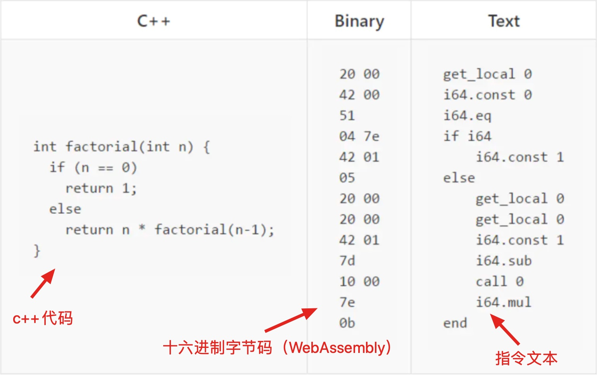
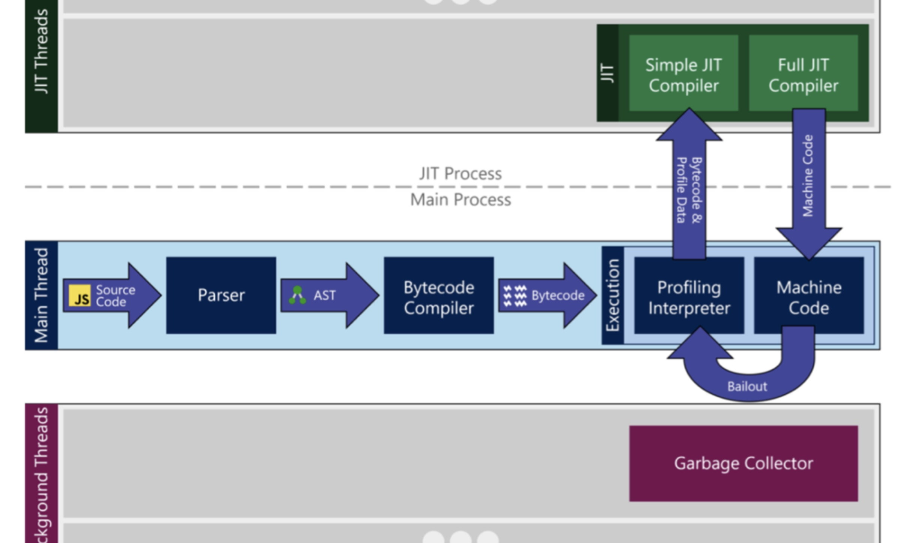
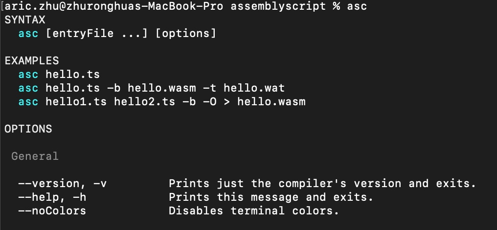
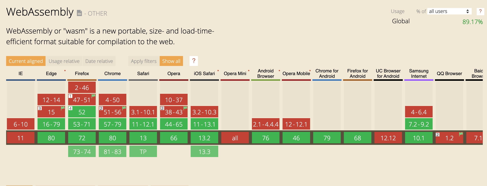

# WebAssembly 调研

WebAssembly（以下简称 wasm） 出现于 2015 年，是一个可移植、体积小、加载快并且兼容 Web 的全新格式。



由上图可知，wasm 本质上就是一种编译目标。什么是编译目标？当我们写 TypeScript 的时候，Webpack 最后打包生成的 JavaScript 文件就是编译目标。只不过这里就是十六进制字节码格式，而符合这种格式的编译结果就称之为 wasm。

所以只要浏览器支持 wasm 格式的字节码的运行，理论上任何能编译成 wasm 的语言都可以写前端了（用高级编程语言编译出字节码放到 WebAssembly 虚拟机中才能运行， 浏览器厂商需要做的就是根据 WebAssembly 规范实现虚拟机）。

这里需要区别一下 wasm 字节码和机器码的区别。wasm 字节码和机器码非常的相似，但这两者是不同的概念。对于机器码，是由0和1组成的，并直接给机器运行的，所以它会依赖底层 CPU 架构，比如  x86、AMD64、ARM，所以在编译机器码的时候需要指定 CPU 架构。但 wasm 字节码是一种抹平了不同 CPU 架构的字节码，它不能直接在任何 CPU 上运行，需要虚拟机来执行，但由于它非常接近机器码，因此也可以快速的被翻译成机器码运行。对于浏览器，只要按照 wasm 的规范实现这个虚拟机就可以运行 wasm 字节码了。

wasm 的出现主要是为了解决前端性能瓶颈的。众所周知，JavaScript 这门解释型编程语言的作者Brendan Eich，仓促的创造了这门如今被广泛使用的语言，以至于 js 的发展史甚至在某种层面上变成了填坑史。下面会详细说明为什么没有静态类型会损耗性能。

## JavaScrit 慢在哪里

为了能说明这个问题，我们首先来看下 js 在浏览器中的运行过程。下图展示了在 Microsoft Edge 浏览器中 js 的运行流程。



我们从 Main Process 中开始看，首先浏览器获取到 js 的源码，然后进入 Parser 模块，代码被转换成 AST，然后再通过 Bytecode Compiler，将 AST 编译成引擎可以读取执行的字节码 Bytecode。最后字节码进入翻译器进行翻译运行。

在代码运行的过程中，引擎会对于执行次数较多的 function 进行优化编译成 Machine Code，并打包送到顶部的 JIT 中，下次再执行这个 function 的时候，就会直接执行编译好的 Machiine Code。但由于 Javascript 的动态变量，上一次运行时可能是 Array 类型，下一次就变成了 Object，所以当这种情况发生的时候，上述引擎所做的优化就失效了，需要重新优化。

从上述的运行过程中，我们知道了一个 js 函数要经过 Parser 以及 Bytecode Compiler 这两个步骤，而在引擎执行过程中，这两个步骤也是最耗时的。

对于 wasm，因为直接跳过了 Parser 以及 Bytecode Compiler 阶段，是进过编译器编译后的代码，体积小，起步快，并且能有效的提升性能。

wasm 在语法上完全脱离 JavaScript，同时具有沙盒化的执行环境。wasm 同样的强制静态类型，是 C/C++/Rust 的编译目标。

## 使用方法

首先需要特别注意的是 WebAssembly 还没有和 "\<script type=module\>" 或 ES6 的 import 语句集成，也就是说，当前还没有内置的方式让浏览器为你获取模块。当前唯一的方式就是创建一个包含你的 WebAssembly 模块二进制代码的 ArrayBuffer 并且使用 WebAssembly.instantiate() 编译它。这与 new Function(string) 类似，除了使用一个包含了 WebAssembly 源代码的数组缓存替换掉包含了 JavaScript 源代码的字符串。

### 使用 fetch 加载

Fetch 是一个用来获取网络资源的方便现代的 API。

假设网络上有一个叫做 simple.wasm 的 WebAssembly 模块：

* 我们可以使用 fetch() 全局函数来轻松地获取它，该函数返回一个可以解析为 Response 对象的 promise。
* 我们可以使用 arrayBuffer() 函数把响应（response）转换为带类型数组，该函数返回一个可以解析为带类型数组的 promise。
* 最后，我们使用 WebAssembly.instantiate() 函数一步实现编译和实例化带类型数组。

最终代码块看起来像这样：

```js
fetch('module.wasm').then(response =>
  response.arrayBuffer()
).then(bytes =>
  WebAssembly.instantiate(bytes, importObject)
).then(results => {
  // Do something with the compiled results!
})
```

### 使用 AssemblyScript 编写 wasm

AssemblyScript 定义了一个 TypeScript 的子集，意在帮助 TS 背景的同学，通过标准的 JavaScript API 来完成到 wasm 的编译，从而消除语言的差异，让程序猿可以快乐的编码。
AssemblyScript 项目主要分为三个子项目：

* AssemblyScript：将 TypeScript 转化为 wasm 的主程序
* binaryen.js：AssemblyScript 主程序转化为 wasm 的底层实现，依托于 binaryen 库，是对vbinaryenv的 TypeScript封装。
* wast.js：AssemblyScriptv主程序转化为 wasm 的底层实现，依托于 wast 库，是对 wast 的 TypeScript 封装。

使用步骤如下：

#### 第一步：安装依赖

运行如下命令获取 AssemblyScript 的支持：

```shell
git clone https://github.com/AssemblyScript/assemblyscript.git
cd assemblyscript
npm install
npm link
```

安装完以后可以运行命令 ```asc``` 来判断是否安装正确。



#### 第二步：新建项目

我们新建一个 demo 的文件夹，并进入 demo 文件夹，进行 npm 初始化，新建 assembly 文件夹，并在该文件夹中添加 module.ts 文件，内容如下：

```ts
export function f(x: i32): i32 {
    if (x === 1 || x === 2) {
        return 1
    }
    return f(x - 1) + f(x - 2)
}
```

#### 第三步：配置与编译

为了后面运行简便，我们把build步骤加入到npm scripts里面，方法是打开项目根目录的package.json，更新scripts字段为：

```json
    "scripts": {
        "build": "npm run build:untouched && npm run build:optimized",
        "build:untouched": "asc assembly/module.ts -t dist/module.untouched.wat -b dist/module.untouched.wasm --validate --sourceMap --measure",
        "build:optimized": "asc assembly/module.ts -t dist/module.optimized.wat -b dist/module.optimized.wasm --validate --sourceMap --measure --optimize"
    }
```

我们把编译目标放到项目根目录的dist文件夹。直接运行 ```npm run build``` 命令进行编译后，在 dist 文件夹下会有 6 个新的文件。

#### 第四步：引入

经过上面的三步以后，我们现在已经有了编译后的 wasm 文件了。但由于 wasm 目前还只能由 Javascript 来引入，所以我们还需要编写 js 代码来引入该模块。

引入方式根据环境不同主要有 node 环境下的引入，以及在浏览器中的引入。

**在 node 环境中引入方式如下**：

首先在项目根目录下新建一个 module_node.js 文件，内容如下：

```js
const fs = require("fs")
const wasm = new WebAssembly.Module(fs.readFileSync(__dirname + "/dist/module.optimized.wasm"), {})

const importObject = {
    env: {
        'memoryBase': 0,
        'tableBase': 0,
        'memory': new WebAssembly.Memory({initial: 256}),
        'table': new WebAssembly.Table({initial: 256, element: 'anyfunc'}),
        abort: function () {},
    }
}

module.exports = new WebAssembly.Instance(wasm, importObject).exports
```

接着我们就可以在其他文件中使用了，我们新建一个 index_node.js 文件，内容如下：

```js
var myModule = require('./module_node.js')
console.log(myModule.fibonacci(10))
```

**在 浏览器环境中引入方式如下**：

这里介绍结合 webpack4 加载的方式，由于 webpack4 中已经提供了默认的 wasm 的加载方案，所以我们可以很优雅的引入。我们在根目录下新建 webpack.config.js，main.js 和 index.html 文件，其中 main.js 文件内容如下：

```js
import('./dist/module.optimized.wasm').then(module => {
    const container = document.createElement('div')
    container.innerText = 'fibonacci(10) is: ' + module.fabonacci(10)
    document.body.appendChild(container)
})
```

## 与 js 的性能对比

:**todo**

## 目前的支持情况

浏览器支持情况如下：



目前能编译成 WebAssembly 字节码的高级语言有：

* AssemblyScript: 语法和 TypeScript 一致，对前端来说学习成本低，为前端编写 WebAssembly 最佳选择
* c\c++: 官方推荐的方式，详细使用见文档
* Rust: 语法复杂、学习成本高，对前端来说可能会不适应。详细使用见文档
* Kotlin: 语法和 Java、JS 相似，语言学习成本低，详细使用见文档
* Golang: 语法简单学习成本低。但对 WebAssembly 的支持还处于未正式发布阶段，详细使用见文档

## 实际应用案例

在这里能够举的例子还是很多，比如 AutoCAD、GoogleEarth、Unity、Unreal、PSPDKit、WebPack 等等。拿其中几个来简单说一下。

### AutoCAD

这是一个用于画图的软件，在很长的一段时间是没有 Web 的版本的，原因有两个，其一，是 Web 的性能的确不能满足他们的需求。其二，在 WebAssembly 没有面世之前，AutoCAD 是用 C++ 实现的，要将其搬到 Web 上，就意味着要重写他们所有的代码，这代价十分的巨大。

而在 WebAssembly 面世之后，AutoCAD 得以利用编译器，将其沉淀了30多年的代码直接编译成 WebAssembly，同时性能基于之前的普通 Web 应用得到了很大的提升。正是这些原因，得以让 AutoCAD 将其应用从 Desktop 搬到 Web 中。

### Google Earth

Google Earth 也就是谷歌地球，因为需要展示很多 3D 的图像，对性能要求十分高，所以采取了一些 Native 的技术。最初的时候就连 Google Chrome 浏览器都不支持 Web 的版本，需要单独下载 Google Earth 的 Destop 应用。而在 WebAssembly 之后呢，谷歌地球推出了 Web 的版本。而据说下一个可以运行谷歌地球的浏览器是 FireFox。

## 参考链接

1. [Webassembly 官网](https://webassembly.org/)

2. [WebAssembly完全入门——了解wasm的前世今身](https://juejin.im/post/5be293daf265da616c65157e)

3. [20分钟上手 webAssembly](https://juejin.im/post/5b7a3f3cf265da43606e9109)

4. [WebAssembly 现状与实战](https://www.ibm.com/developerworks/cn/web/wa-lo-webassembly-status-and-reality/index.html)

5. [MDN WebAssembly](https://developer.mozilla.org/zh-CN/docs/WebAssembly)
