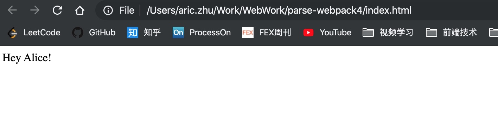

# loader

loader 是一个导出为 JavaScript 函数的模块，它的作用就是处理那些非 js 类型的文件，并且最终返回一个 String 或者 Buffer，代表了模块的 JavaScript 源码。这里我们先简单介绍下 loader 的基本用法。如下，如果要处理 css 类型的文件，我们可以使用 css-loader。先通过 npm 安装 css-loader 后就可以在配置文件中通过 modules 字段进行配置了，如下：

```js
module.exports = {
    ...
    module: {
        rule: [
            {
                test: /\.css$/,
                use: 'css-loader'
            }
        ]
    }
    ...
}
```

这样，当 webpack 在分析依赖的时候，遇到 css 类型文件会自动调用 css-loader 模块来处理

关于 loader，还有以下几个特性：

1. 对于一种类型的文件可以有多个 loader 进行处理，并且这多个 loader 对资源进行流水线式的处理，一组链式的 loader 将按照相反的顺序执行。loader 链中的第一个 loader 返回值给下一个 loader。在最后一个 loader，返回 webpack 所预期的 JavaScript
2. loader 可以是同步的，也可以是异步的
3. ...

## 编写 loader

在了解了上述基本的 loader 概念以后，这里我们以实际编写一个简单的 loader 来进行讲解

现在我们需要有一个 loader，它专门处理 txt 格式的文件类型，功能是将文件中的 [name] 替换成 loader 选项中设置的 name，然后返回包含默认导出文本的 js 模块

首先我们在 loaders 目录下新建一个 loader.js 的文件，作为我们的 loader 源码，内容如下：

```js
const { getOptions } = require('loader-utils')

module.exports = function loader (source) {
    const options = getOptions(this)

    source = source.replace(/\[name\]/g, options.name)

    return `module.exports = ${ JSON.stringify(source) }`
}
```

然后在 test 目录下新建一个 example.txt 作为测试文件，内容如下：

```txt
Hey [name]!
```

接着我们可以修改配置文件如下：

```js
module.exports = {
    ...
    entry: './src/loader_test.js',
    module: {
        rules: [
            {
                test: /\.txt$/,
                use: {
                    loader: path.resolve(__dirname, '../loader/loader.js')
                    options: {
                        name: 'Alice'
                    }
                }
            }
        ]
    }
    ...
}
```

其中入口文件 loader_test 内容如下：

```js
const txt = require('../test/example.txt')

let dom = document.getElementById('app')
dom.innerText = txt
```

将 example.txt 文件导入，并加入到页面上。最终我们运行 webpack 进行构建，然后用浏览器打开 index.html 文件，结果如下：



可以看到进过我们自己编写的 loader ，成功的将原先的 txt 文件中的 [name] 替换成了 options 中配置的 name 的值

至此，一个 loader 就编写完成了。这里我们做一个简单的小结，对于 loader 的编写，首先它会对外导出一个函数作为接口，同时这个函数的参数就是文件的文本内容，我们可以根据这个内容做一些自己的处理，最后再返回一个代表 JavaScript 源码的 String 或者 Buffer 即可

## 常用 loader 介绍

### babel-loader

将JS代码向低版本转换

### style-loader

webpack 不能直接处理 css，需要借助 loader。如果是 .css，我们需要的 loader 通常有： style-loader、css-loader，考虑到兼容性问题，还需要 postcss-loader，而如果是 less 或者是 sass 的话，还需要 less-loader 和 sass-loader，这里配置一下 less 和 css 文件(sass 的话，使用 sass-loader即可)

### url-loader

我们可以使用 url-loader 或者 file-loader 来处理本地的资源文件。url-loader 和 file-loader 的功能类似，但是 url-loader 可以指定在文件大小小于指定的限制时，返回 DataURL，因此，个人会优先选择使用 url-loader

### html-withimg-loader

处理 html 中的本地图片

## 参考资料

[编写一个loader](https://www.webpackjs.com/contribute/writing-a-loader/)

[带你深度解锁Webpack系列(基础篇)](https://juejin.im/post/5e5c65fc6fb9a07cd00d8838)
