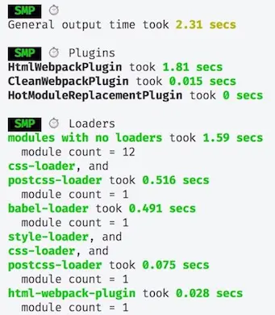

# optimize

本文主要介绍在 webpack 使用过程中的一些优化，包括打包优化、构建时间优化等

在具体介绍优化前，首先我们需要有个能量化的指标，这样我们才能直观的评价优化的效果

speed-measure-webpack-plugin 插件可以测量各个插件和loader所花费的时间，使用之后，构建时，会得到类似下面这样的信息：

## exclude/include

我们可以通过 exclude、include 配置来确保转译尽可能少的文件。顾名思义，exclude 指定要排除的文件，include 指定要包含的文件

exclude 的优先级高于 include，在 include 和 exclude 中使用绝对路径数组，尽量避免 exclude，更倾向于使用 include

## cache-loader

在一些性能开销较大的 loader 之前添加 cache-loader，将结果缓存中磁盘中。默认保存在 node_modueles/.cache/cache-loader 目录下

## happypack

由于有大量文件需要解析和处理，构建是文件读写和计算密集型的操作，特别是当文件数量变多后，Webpack 构建慢的问题会显得严重

HappyPack 它把任务分解给多个子进程去并发的执行，子进程处理完后再把结果发送给主进程

## thread-loader

除了使用 Happypack 外，我们也可以使用 thread-loader ，把 thread-loader 放置在其它 loader 之前，那么放置在这个 loader 之后的 loader 就会在一个单独的 worker 池中运行

在 worker 池(worker pool)中运行的 loader 是受到限制的。例如：

## JS 多进程压缩

虽然很多 webpack 优化的文章上会提及多进程压缩的优化，不管是 webpack-parallel-uglify-plugin 或者是 uglifyjs-webpack-plugin 配置 parallel。不过这里我要说一句，没必要单独安装这些插件，它们并不会让你的 Webpack 构建速度提升

当前 Webpack 默认使用的是 TerserWebpackPlugin，默认就开启了多进程和缓存，构建时，你的项目中可以看到 terser 的缓存文件 node_modules/.cache/terser-webpack-plugin

* 这些 loader 不能产生新的文件
* 这些 loader 不能使用定制的 loader API（也就是说，通过插件）
* 这些 loader 无法获取 webpack 的选项设置

## HardSourceWebpackPlugin

HardSourceWebpackPlugin 为模块提供中间缓存，缓存默认的存放路径是: node_modules/.cache/hard-source

配置 hard-source-webpack-plugin，首次构建时间没有太大变化，但是第二次开始，构建时间大约可以节约 80%

## noParse

如果一些第三方模块没有AMD/CommonJS规范版本，可以使用 noParse 来标识这个模块，这样 Webpack 会引入这些模块，但是不进行转化和解析，从而提升 Webpack 的构建性能 ，例如：jquery 、lodash

## resolve

resolve 配置 webpack 如何寻找模块所对应的文件。假设我们确定模块都从根目录下的 node_modules 中查找，我们可以配置:

## IgnorePlugin

webpack 的内置插件，作用是忽略第三方包指定目录

例如: moment (2.24.0版本) 会将所有本地化内容和核心功能一起打包，我们就可以使用 IgnorePlugin 在打包时忽略本地化内容

## externals

我们可以将一些JS文件存储在 CDN 上(减少 Webpack打包出来的 js 体积)，在 index.html 中通过 \<script\> 标签引入

## DllPlugin

有些时候，如果所有的JS文件都打成一个JS文件，会导致最终生成的JS文件很大，这个时候，我们就要考虑拆分 bundles

DllPlugin 和 DLLReferencePlugin 可以实现拆分 bundles，并且可以大大提升构建速度，DllPlugin 和 DLLReferencePlugin 都是 webpack 的内置模块

我们使用 DllPlugin 将不会频繁更新的库进行编译，当这些依赖的版本没有变化时，就不需要重新编译。我们新建一个 webpack 的配置文件，来专门用于编译动态链接库，例如名为: webpack.config.dll.js

## 抽离公共代码

抽离公共代码是对于多页应用来说的，如果多个页面引入了一些公共模块，那么可以把这些公共的模块抽离出来，单独打包。公共代码只需要下载一次就缓存起来了，避免了重复下载

抽离公共代码对于单页应用和多页应该在配置上没有什么区别，都是配置在 optimization.splitChunks 中

## webpack-bundle-analyzer

我们可以借助 webpack-bundle-analyzer 来查看打包出来的哪个包比较大，从而有针对性的进行优化

## tree-shaking

如果使用ES6的import 语法，那么在生产环境下，会自动移除没有使用到的代码

## 参考资料

[带你深度解锁Webpack系列(优化篇)](https://juejin.im/post/5e6cfdc85188254913107c1f)
