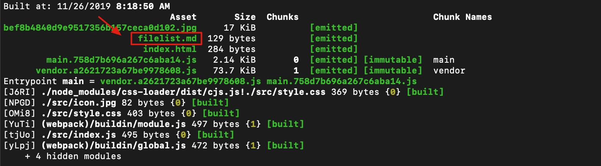
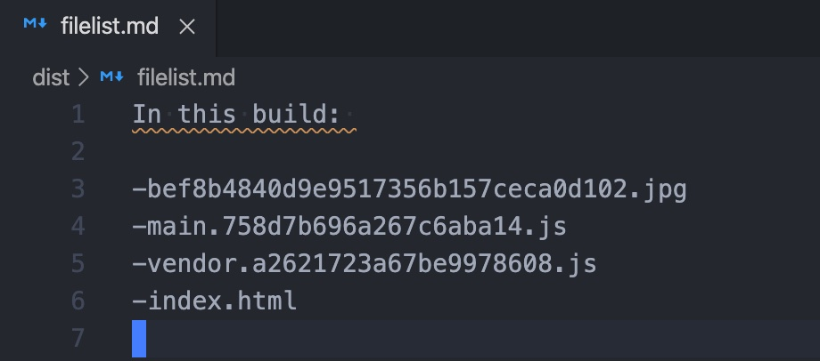

# plugin

在 webpack 中除了提供 loader 模块能让开发这参与到构建中以外，还提供了一个更加强大，并能让开发者参与整个构建过程中的所有流程的模块，那就是插件（plugin）。插件的编写和 loader 类似，也需要有一定的规则。一个完整的插件由以下几个部分组成：

- 一个 JavaScript 命名函数。
- 在插件函数的 prototype 上定义一个 apply 方法。
- 指定一个绑定到 webpack 自身的事件钩子。
- 处理 webpack 内部实例的特定数据。
- 功能完成后调用 webpack 提供的回调。

一个简单的插件编写示例如下：

```js
// 一个 JavaScript 命名函数。
function MyExampleWebpackPlugin() {

};

// 在插件函数的 prototype 上定义一个 `apply` 方法。
MyExampleWebpackPlugin.prototype.apply = function(compiler) {
  // 指定一个挂载到 webpack 自身的事件钩子。
  compiler.plugin('webpacksEventHook', function(compilation /* 处理 webpack 内部实例的特定数据。*/, callback) {
    console.log("This is an example plugin!!!");

    // 功能完成后调用 webpack 提供的回调。
    callback();
  });
};
```

在编写完插件以后，就可以在配置文件中调用了，如下：

```js
var HelloWorldPlugin = require('hello-world');

var webpackConfig = {
  // ... 这里是其他配置 ...
  plugins: [
    new HelloWorldPlugin({options: true})
  ]
};
```

## 编写 plugin

在了解了上述的基本原理与钩子函数之后，接下来我们就可以实际编写一个插件了。假设现在我们需要有个插件，它能够在每次构建完成后生成 filelist.md 文件，文件内容是本次构建的输出文件名列表。

为此，我们在 plugin 目录下新建一个 file-list.js 的文件，内容如下：

```js
function FileListPlugin (options) {}

FileListPlugin.prototype.apply = function (compiler) {
    compiler.plugin('emit', function (compilation, callback) {
        var filelist = 'In this build: \n\n'

        for (var filename in compilation.assets) {
            filelist += ('-' + filename + '\n')
        }

        compilation.assets['filelist.md'] = {
            source: function () {
                return filelist
            },
            size: function () {
                return filelist.length
            }
        }

        callback()
    })
}

module.exports = FileListPlugin
```

接着我们在 webpack 的配置文件中引用这个插件，如下：

```js
const FileListPlugin = require('../plugin/file-list')

module.exports = {
    // ...
    plugin: [
        new FileListPlugin()
    ]
}
```

接着我们进行构建，最终输出如下：





如上图所示，我们编写的这个插件已经能正常工作了

## 常用 plugin 介绍

### html-webpack-plugin

这个插件可以帮助我们自动生成 index.html 文件，同时插入每次打包后的 js 文件和 css 文件等

### clean-webpack-plugin

可以在每次打包前帮助我们删除上一次的打包文件。支持在删除的时候忽略指定文件等配置

### copy-webpack-plugin

有些时候，我们需要使用已有的JS文件、CSS文件（本地文件），但是不需要 webpack 编译。例如，我们在 public/index.html 中引入了 public 目录下的 js 或 css 文件。这个时候，如果直接打包，那么在构建出来之后，肯定是找不到对应的 js / css 了。

这时候我们就需要 copy-webpack-plugin 这个插件了，它的作用就是将单个文件或整个目录复制到构建目录

### ProvidePlugin

webpack 内置插件，提供定义全局变量的功能

### mini-css-extract-plugin

将 css 文件单独抽离打包

### optimize-css-assets-webpack-plugin

使用 mini-css-extract-plugin，CSS 文件默认不会被压缩，因此如果想要压缩 css 文件，则需要使用这个插件来实现

### HotModuleReplacementPlugin

webpack 内置插件，提供热更新功能

## 参考资料

[编写一个plugin](https://www.webpackjs.com/contribute/writing-a-plugin/)

[带你深度解锁Webpack系列(进阶篇)](https://juejin.im/post/5e6518946fb9a07c820fbaaf)
