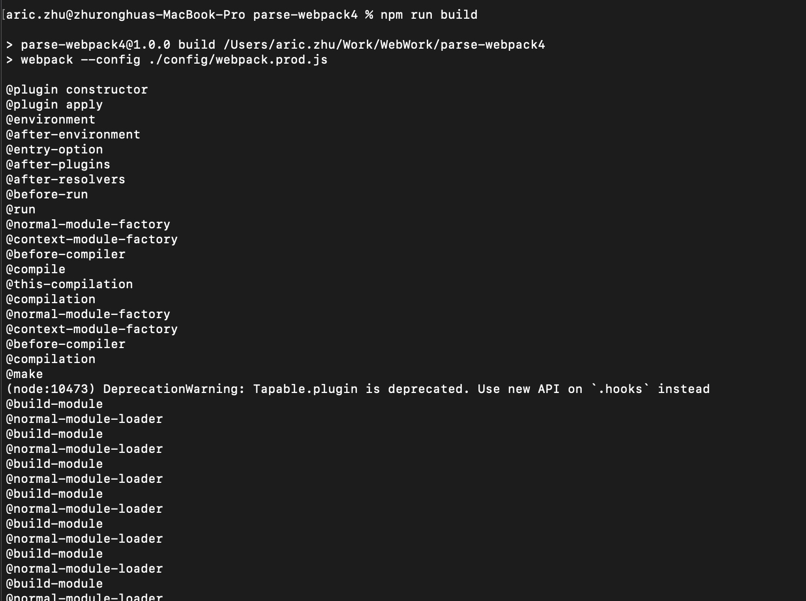

# webpack 构建流程

我们先简单介绍下 webpack 的整个构建流程，如下：

```flow
初始化参数 ---> 开始编译 ---> 确定入口 ---> 编译模块 ---> 完成编译模块 ---> 输出资源 ---> 输出完成
```

各个阶段执行的操作如下：

1. 初始化参数：从配置文件 (默认 webpack.config.js) 和 shell 语句中读取与合并参数，得出最终的参数
2. 开始编译 (compile)：用上一步得到的参数初始化 Comiler 对象，加载所有配置的插件，通过执行对象的 run 方法开始执行编译
3. 确定入口：根据配置中的 entry 找出所有的入口文件
4. 编译模块：从入口文件出发，调用所有配置的 Loader 对模块进行翻译,再找出该模块依赖的模块，再递归本步骤直到所有入口依赖的文件都经过处理
5. 完成编译模块：经过第四步之后，得到了每个模块被翻译之后的最终内容以及他们之间的依赖关系
6. 输出资源：根据入口和模块之间的依赖关系，组装成一个个包含多个模块的 chunk，再将每个 chunk 转换成一个单独的文件加入输出列表中，这是可以修改输出内容的最后机会
7. 输出完成：在确定好输出内容后，根据配置 (webpack.config.js && shell) 确定输出的路径和文件名，将文件的内容写入文件系统中 (fs)

在以上过程中，webpack 会在特定的时间点广播特定的事件，插件监听事件并执行相应的逻辑，并且插件可以调用 webpack 提供的 api 改变 webpack 的运行结果

接下来我们来看下在各个阶段中 webpack 会广播出来的事件，也就是事件钩子。如下：

**初始化阶段的事件：**

| 事件 | 描述 |
| ---- | ---- |
| 初始化参数 | 从配置文件和shell语句中读取与合并参数，得出最终的参数，这个过程还会执行配置文件中的插件实例化语句 new Plugin() |
| 实例化 Compiler | 实例化 Compiler，传入上一步得到的参数，Compiler 负责文件监听和启动编译。在 Compiler 实例中包含了完整的 webpack 配置，全局只有一个 Compiler 实例。 |
| 加载插件 | 依次调用插件的 apply 方法，让插件可以监听后续的所有事件节点。同时向插件中传入 compiler 实例的引用，以方便插件通过 compiler 调用 webpack的api |
| ... | ... |

**编译阶段的事件：**

| 事件 | 描述 |
| ---- | ---- |
| run | 启动一次编译 |
| compile | 告诉插件一次新的编译将要启动，同时会给插件带上compiler对象 |
| compilation | 当 webpack 以开发模式运行时，每当检测到文件的变化，便有一次新的 compilation 被创建。一个 Compilation对象包含了当前的模块资源、编译生成资源、变化的文件等。compilation 对象也提供了很多事件回调给插件进行拓展 |
| after-compile | 一次 compilation 执行完成 |
| ... | ... |

**输出阶段的事件：**

| 事件 | 描述 |
| ---- | ---- |
| should-emit | 所有需要输出的文件已经生成,询问插件有哪些文件需要输出,有哪些不需要输出 |
| emit | 确定好要输出哪些文件后,执行文件输出, *可以在这里获取和修改输出的内容* |
| after-emit | 文件输出完毕 |
| done | 成功完成一次完整的编译和输出流程 |
| failed | 如果在编译和输出中出现错误,导致webpack退出,就会直接跳转到本步骤,插件可以在本事件中获取具体的错误原因 |
| ... | ... |

在简单了解了上述的钩子事件以后，接下来我们可以实际写一个插件来监听上述的事件，在 plugin 文件夹下新建一个 lifecycle-plugin.js 文件，内容如下：

```js
// 查看 webpack 构建的整个过程的插件
const path = require('path')

class LifeCyclePlugin {
    constructor () {
        console.log('@plugin constructor')
    }

    apply (compiler) {
        console.log('@plugin apply')

        compiler.plugin('before-run', (options, callback) => {
            console.log('@before-run')
            callback()
        })

        compiler.plugin('run', (options, callback) => {
            console.log('@run')
            callback()
        })

        compiler.plugin('compile', options => {
            console.log('@compile')
        })

        compiler.plugin('compilation', options => {
            console.log('@compilation')
        })

        compiler.plugin('compilation', compilation => {
            compilation.plugin('build-module', options => {
                console.log('@build-module')
            })
            // ...
        })

        compiler.plugin('emit', (options, callback) => {
            console.log('@emit')
            callback()
        })

        compiler.plugin('done', options => {
            console.log('@done')
        })

        // ...
    }
}

module.exports = LifeCyclePlugin
```

在编写了上述的插件以后，接下来我们需要在 webpack 配置文件中引用上述插件，如下：

```js
const LifeCyclePlugin = require('../plugin/lifecycle-plugin')

module.exports = {
    // ...
    plugin: [
        new LifeCyclePlugin()
    ]
}
```

接下来我们就可以直接运行构建来看一下插件效果，如下：



我们可以看到在构建的过程中确实进入了这些钩子函数

## 参考资料
