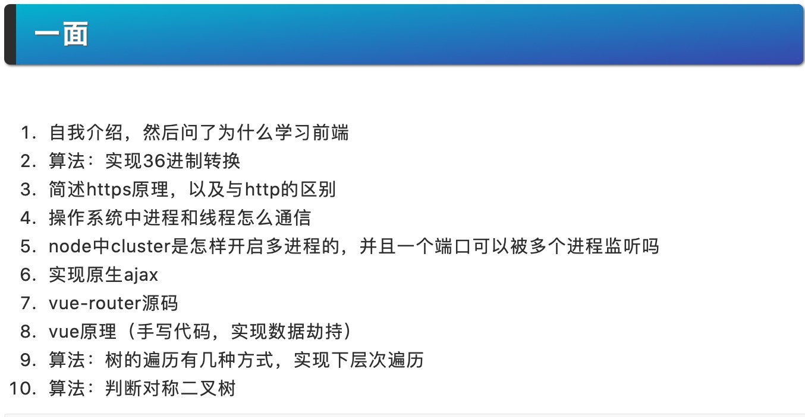
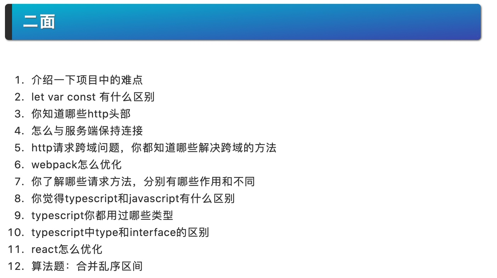
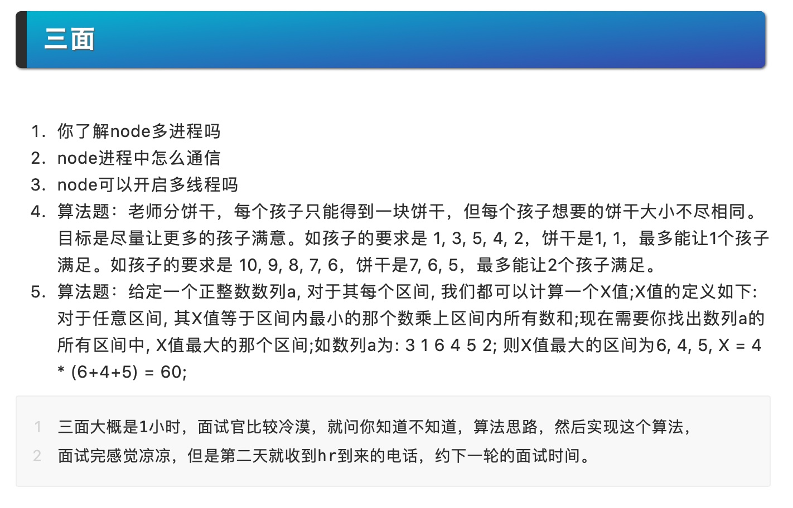
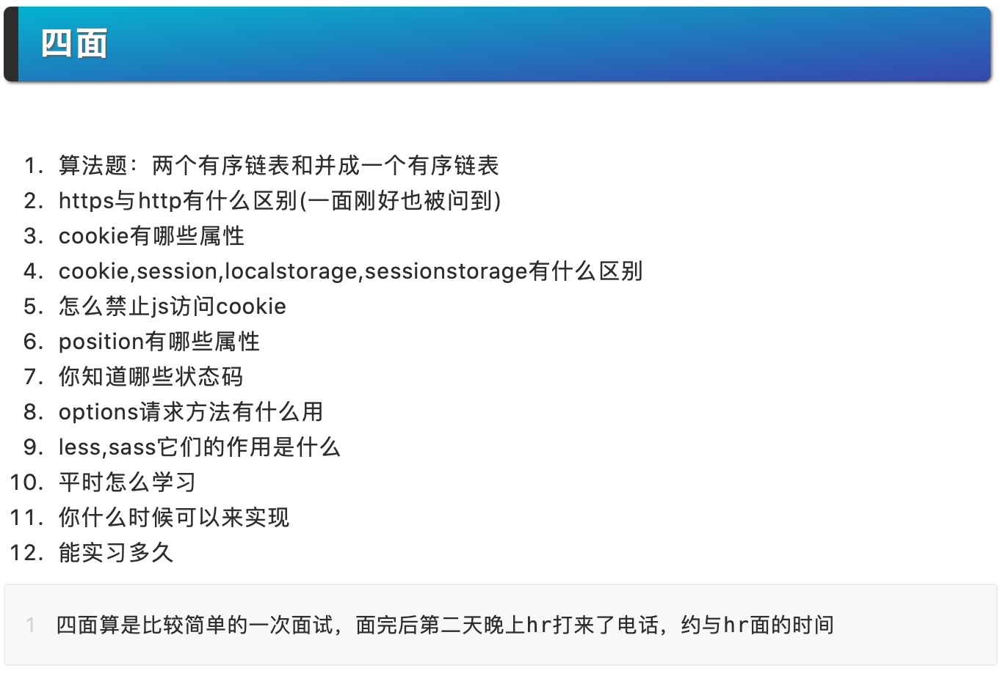
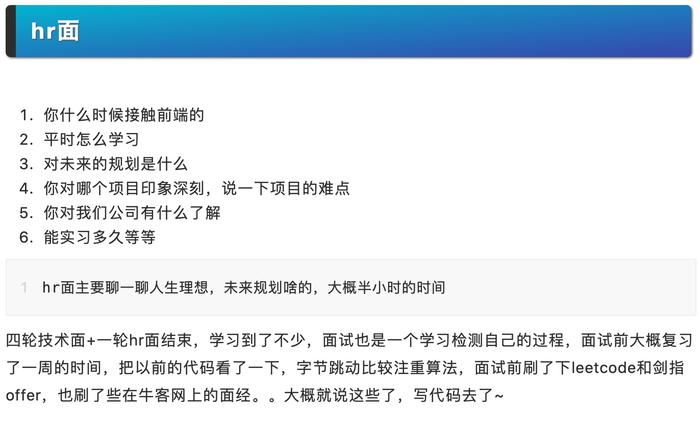

# 前端面试题集锦

## 字节跳动

笔试:

apply, call, bind
原码，补码，反码
事件委托
手动实现 Promise.all 和 Promise.race

一轮
1.dom react原理
2.css布局
3.js原型链继承
4.fetch取消
5.eventloop
6.instanceof
7.promise封装setstate
8.redux基本组成和设计单向数据流
9.https协议的过程
10.https获取加密密钥的过程
11.http的方法有哪几种
12.类式继承的方案
13.prototype继承的实现
14.数字千分位处理，正则和非正则都要实现
15.借用构造继承，几种组合继承方式
16.看编程代码说出运行结果：
Process.nextTick，setImmediate 和promise.then 的优先级
Process.nextTick，pronise, setImmediate的优先级
17.实现一个bind函数
18.千位加逗号
19.三个继承方式的优缺点
20.odejs的事件循环
21.bfc
22.css实现正方形div水平垂直居中
23.koa1的原理,继承
24.最后是一个写代码 处理有依赖的异步任务 加重试
26.什么是闭包，
27..最长子序列
28..二叉树中序遍历5http握手原理
29.react 新版本的特性
30.多空格字符串格式化为数组
31.bind函数运行结果
32.点击table的td显示td内容
33.数字千分位处理
34.固定日期与当前时间格式化处理
35.上中下三栏布局
37.实现一个子类实例可以继承父类的所有方法
38.实现sum(1)(2)(3).valueOf()，实现这么一个sum函数，返回6
39.实现taskSum(1000,()=>{console.log(1)}).task(1200,()=>{console.log(2)}).task(1300,()=>{console.log(3)})，这里等待1s，打印1，之后等待1.2s，打印2，之后打印1.3s，打印3
31.Jsonp跨域
32.js原型继承 & 原型链
33.promise
34.二叉树搜寻算法，
35..算法：前端做并发请求控制
36. 宏任务微任务
37. libUA
38.. express ctx 中间键代码实现
39.. vue 发布订阅和虚拟dom代码实现
40. 请实现如下的函数，可以批量请求数据，所有的 URL 地址在 urls 参数中，同时可以通过 max 参数控制请求的并发度，当所有请求结束之后，需要执行 callback 回调函数。发请求的函数可以直接使用 fetch 即可
41.二叉树遍历
42.并发请求最大值是 10，怎么处理队列
43.css 画出一个三角形
44.node 网关
45.csrf/xss 攻击原理
46.react diff 原理
47.事件循环
48.react diff算法，key的作用，setData的机制，事件合成
49.vue的v-model原理
50.实现一个方法，参数是一个generator函数，执行结果是执行完所有generator中的yield
51.获取页面所有img并且下载
52.两个同源tab之间的交互，数据同步
53.怎么将一个异步方法promise化，以及实现promise.all()方法
54. vue单页多页的区别，vue路由实现原理
55. vue数据驱动视图原理？更新视图的过程是否是同步的操作？
56. nodejs相关的应用（答：开发命令行工具、web服务，ssr，数据库操作等）
57. vue项目开发环境如何配置？wepack-dev-server 热更新功能实现原理
58. express、koa、redis等技术相关应用
59.. [1,2,3].map(parseInt) 执行结果
60.实现一个 Promise.all
61.手写代码：给定一个数组，形如 [1, 1, 2 , 3, 3, 3, 3, 4, 6, 6]，给定一个数 n，例如 3，找出给定的数 n 在数组内出现的次数，要求时间复杂度小于 O(n)
62.Bind 方法手写实现
63.手写代码二叉树深度为n的遍历，遍历有哪几种方式
64.promise.then 的调用
65.promise.all()的实现原理
66.div的点击事件回调不执行的原因，具体的一种原因怎么定位问题
67.hybrid 实现bridge的方法
68.最有挑战的项目
69.小程序框架的实现原理
70.Bind 方法手写实现
71.手写代码二叉树深度为n的遍历，遍历有哪几种方式
72.promise.then 的调用
73.promise.all()的实现原理
74.div的点击事件回调不执行的原因，具体的一种原因怎么定位问题
75.hybrid 实现bridge的方法
76.最有挑战的项目
77.小程序框架的实现原理
78.vue-router路由监听的原理
79.webpack打包的原理，webpack有没有针对打包过程做一些优化提升打包速度
80.请实现如下的函数，可以批量请求数据，所有的 URL 地址在 urls 参数中，同时可以通过 max 参数，控制请求的并发度，实现max个请求执行完之后再执行下max个请求，当所有请求结束之后，需要执行 callback 回调函数。发请求的函数可以直接 使用 fetch 即可
81.vue双向绑定的原理
82.写一个eventBus
83.元素水平垂直居中
84.vuex mobox
85.小程序架构优化 日志系统
86.写一个eventBus
87.元素水平垂直居中
88.vuex mobox
89.小程序架构优化 日志系统

二轮:
1.主要是围绕你的项目经历和技术，有一定的深度，主要还是要对项目全面熟悉；还有一个就是函数柯理化的编码实现
2. 函数柯里化、Web安全、react性能优化、react算法原理	
3.上来直接让写一个autocomplete 组件，可能是想考察业务思考点；
4.后续的问题主要会接着业务场景问 扣实际场景 不问知识理论；
5.http网络协议 ；
6.tcp为什么是可靠的；
7.js设计模式；
8.solid原则；
9.柯里化；
10. css 单行和多行截断
11. 给一个由域名组成的字符串进行按子域名分组的反转，比如 news.toutiao.com 反转成 com.toutiao.news 需要 in place 做
12..其他技术问题都是穿插在我的业务项目里面的，有点针对实际情景给解决方案
13.实现一个 outsideclick 的 Hoc，触发时调用 子组件的 outsideclick 方法
14.手写一个 redux middleware
15.实现一个 outsideclick 的 Hoc，触发时调用 子组件的 outsideclick 方法
16.最近在做项目（痛点，难点，怎么解决）
17.ssr（ssr csr混合怎么处理）
18.小程序架构（带来的优缺点）
19.状态管理，异步编程（各个优缺点）

三轮：
1.自己做得最有成就的项目
2.自己主动承担并是核心的项目
3.项目深度:比如现场实现vue的数据代理等
4.技术广度:什么是微前端等
5.职业发展
6..js实现依赖注入
7. 接口攻击的方式和防御措施
8. https握手过程
9. 设计模式
10. redux和 mobx的区别
11. js多线程如何共享大的数据
12.问了redis数据结构和实现
13.问hashmap
15.小程序架构优化，
16. 二叉树 ，diff算法，
17. 页面渲染原理， 
18.图像算法 事件循环
19.长列表渲染， 前端安全

算法部分：

* 给定一个数组，形如 [1, 1, 2 , 3, 3, 3, 3, 4, 6, 6]，给定一个数 n，例如 3，找出给定的数 n 在数组内出现的次数，要求时间复杂度小于 O(n)
* ['a','b'],['A','B'],['1','0']，输出['aA1','aA0','aB1','aB0','bA1','bA0','bB1','bB0']，算法的排列组合问题

[一年半前端面试](https://www.ohmyrss.com/post/1583296354893)

